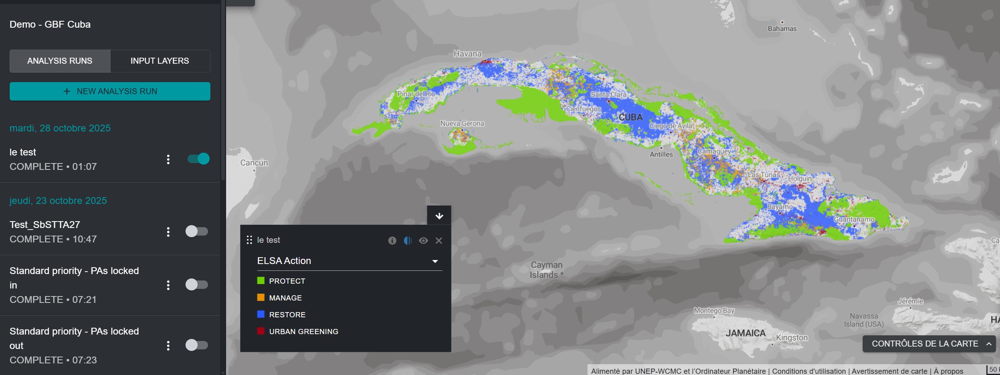

# À quoi sert l'outil ELSA ?

L'outil ELSA permet à divers acteurs d'évaluer de manière collaborative les priorités nationales pour le KMGBF, d'explorer les compromis et les synergies, et d'élaborer des plans spatiaux pour soutenir la mise en œuvre nationale des objectifs 1, 2 et 3. L'outil ELSA produit des cartes de priorisation spatiale qui identifient les zones à protéger, à restaurer, à gérer, et à verdir, qui auront le plus grand impact sur la réalisation des objectifs 1 à 12 du KMGBF. Les utilisateurs disposant d'un [espace de travail UNBL](https://unbiodiversitylab.org/en/unbl-workspaces/) peuvent utiliser l'outil ELSA pour mettre en œuvre une planification spatiale nationale personnalisée dans le cadre d'un processus participatif d'aménagement du territoire. Ils peuvent :

- Afficher les couches d'entrée (également appelées « caractéristiques de planification ») utilisées pour cartographier les objectifs du KMGBF.
- Créer et exécuter de nouvelles analyses ELSA avec différents groupes de parties prenantes. Les utilisateurs peuvent modifier et éditer les analyses ELSA de la manière suivante :
  
	  - Modifier le pourcentage du territoire national alloué à chaque zone d'action fondée sur la nature, y compris la protection (objectif KMGBF 3), la restauration (objectif KMGBF 2), la gestion (objectif KMGBF 10), et/ou le verdissement urbain (objectif KMGBF 12). Ces configurations peuvent être adaptées aux objectifs politiques du pays en matière de conservation, de restauration et de protection, entre autres ;
	  - Choisir de verrouiller les aires protégées existantes à des fins de protection, en veillant à ce que les aires protégées existantes soient sélectionnées dans la carte de solutions ;
	  - Modifier les pondérations de chacune des couches d'entrée (caractéristiques de planification) en fonction de l'importance nationale de la caractéristique cartographiée et de la fiabilité des données d'entrée ; et
	  - Modifier le paramètre du facteur de pénalité des limites pour ajuster la cohésion spatiale de la carte d'action.
	  
- Visualiser et télécharger les heatmaps et les cartes d'action obtenues.
- Téléchargez les heatmaps et les cartes d'action obtenues au format raster, qui peuvent être utilisées pour une analyse plus approfondie en fonction des besoins des parties intéressées dans un logiciel de système d'information géographique (SIG) de bureau.
- Télécharger les résultats et les paramètres d'une analyse ELSA existante sous forme de tableau récapitulatif, disponible aux formats .xlsx, .csv et .json.

L'outil ELSA **ne peut pas** être utilisé pour :

- Ajouter des couches de données supplémentaires à inclure soit comme caractéristiques de planification, soit comme contraintes de zonage.
- Remplacer directement des couches d'entrée par d'autres couches d'entrée.
- Ajouter des fonctionnalités de verrouillage supplémentaires.

Ces modifications, ainsi que le développement d'analyses personnalisées supplémentaires pour répondre aux besoins nationaux, sont disponibles auprès de l'équipe UNBL sur la base du recouvrement des coûts. Pour en savoir plus et explorer les options, veuillez contacter <support@unbiodiversitylab.org>.

L'outil ELSA utilise le package *prioritizr* en arrière-plan comme outil d'optimisation spatiale pour effectuer une analyse ELSA. *Prioritizr* prend en charge un large éventail d'objectifs, de contraintes et de pénalités afin de créer une analyse sur mesure. Les optimisations peuvent être exécutées rapidement sur UNBL (souvent en 3 à 5 minutes). Il peut donc être utilisé pour générer et affiner des plans de conservation en temps réel lors des réunions des parties prenantes, et contribuer à un processus décisionnel plus transparent, inclusif et participatif afin d'identifier les domaines prioritaires pour soutenir la mise en œuvre des objectifs 1, 2 et 3 du KMGBF, avec des avantages connexes importants pour les objectifs 4 à 12.

!!! note
    Les définitions de la terminologie technique mentionnée dans ce guide se trouvent dans l'[Annexe 1](12_annex1.md).

<figure markdown>

<figcaption>Figure 1. Interface initiale de l'outil ELSA sur le UNBL</figcaption>
</figure>