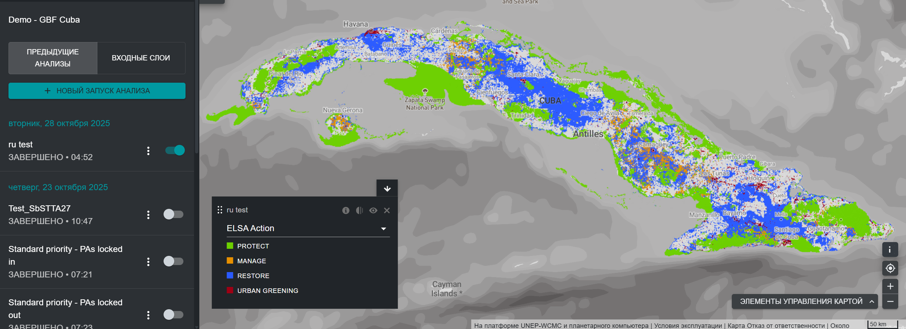

# Для чего предназначен инструмент ELSA?

Инструмент ELSA позволяет различным заинтересованным сторонам совместно оценивать национальные приоритеты в области ГПБ, изучать компромиссы и синергию, а также разрабатывать пространственные планы для поддержки национальной реализации целей 1, 2 и 3. Инструмент ELSA создает карты пространственной приоритезации, которые определяют области для защиты, восстановления, управления. и озеленения городов, которые будут иметь наибольшее влияние на достижение целей 1-12 ГПБ. Пользователи с [рабочим пространством UNBL](https://unbiodiversitylab.org/ru/unbl-workspaces/) могут использовать инструмент ELSA для выполнения индивидуальной национальной пространственной приоритезации в рамках процесса совместного пространственного планирования. Они могут:

  - Просматривать входные слои (также известные как планировочные элементы), используемые для отображения целей ГПБ. 
  - Создавать и выполнять новые анализы ELSA с различными группами заинтересованных сторон. Пользователи могут изменять и редактировать анализы ELSA следующими способами:  
    - Изменять процент территории страны, выделенной для каждой зоны природоохранных действий, включая охрану (цель ГПБ 3), восстановление (цель ГПБ 2), управление (цель ГПБ 10) и/или озеленение городов (цель ГПБ 12). Эти настройки могут быть адаптированы к целям политики страны в области сохранения, восстановления и охраны природы, среди прочего; 
    - Выбрать, следует ли зафиксировать существующие охраняемые территории для защиты, обеспечив обязательное включение существующих охраняемых территорий в карте приоритеных областей; 
    - Изменить веса каждого из входных слоев (планировочных элементов) в зависимости от национальной значимости отображенного слоя и достоверности входных данных; и 
    - Изменить параметр коэффициента штрафа за превышение границ в соответствии с потребностями анализа. 
  - Просматривать и загружать полученные карты приоритетных областей и их перекрытие с другими слоями данных, доступными в UNBL; 
  - Скачать полученные тепловые карты и карты приоритетных областей в растровом формате, которые при необходимости могут быть использованы для дальнейшего анализа в соответствии с потребностями заинтересованных сторон с помощью программного обеспечения географических информационных систем (ГИС); 
  - Загружать результаты и параметры существующего анализа пространственной приоритезации в виде сводной таблицы, доступной в форматах .xlsx, .csv и .json; 

Инструмент ELSA **не может** использоваться для:

  - Добавления дополнительных слоев данных для включения в инструмент интегрированного пространственного планирования в качестве планировачных элементов или ограничений зонирования;  
  - Прямой замены входных слоев другими входными слоями;  
  - Добавления дополнительных фиксированных элементов.   

Эти модификации, а также дальнейшая разработка индивидуальных анализов для удовлетворения национальных потребностей доступны на основе возмещения затрат от команды UNBL. Чтобы узнать больше и изучить возможные варианты, пожалуйста, обращайтесь по адресу support@unbiodiversitylab.org. 

Инструмент ELSA использует пакет prioritizr в бэкэнде в качестве инструмента пространственной оптимизации для проведения анализа пространственной приоритезации. Prioritizr поддерживает широкий выбор целей, ограничений и штрафов для создания индивидуального анализа. Оптимизация может быть выполнена быстро на UNBL (в течении 3-5 минут). Таким образом, его можно использовать для генерации и доработки планов сохранения в реальном времени во время встреч заинтересованных сторон, а также для содействия более прозрачному, инклюзивному и основанному на широком участии процессу принятия решений по определению приоритетных областей для поддержки реализации целей 1, 2 и 3 ГПБ, с мощными сопутствующими выгодами для целей 4-12.  

!!! note
    Определения технической терминологии, упомянутой в руководстве, можно найти в [Приложении 1](12_annex1.md).

<figure markdown>

<figcaption>Рисунок 1. Интерфейс UNBL, отображающий конфигурацию инструмента ELSA на UNBL</figcaption>
</figure>