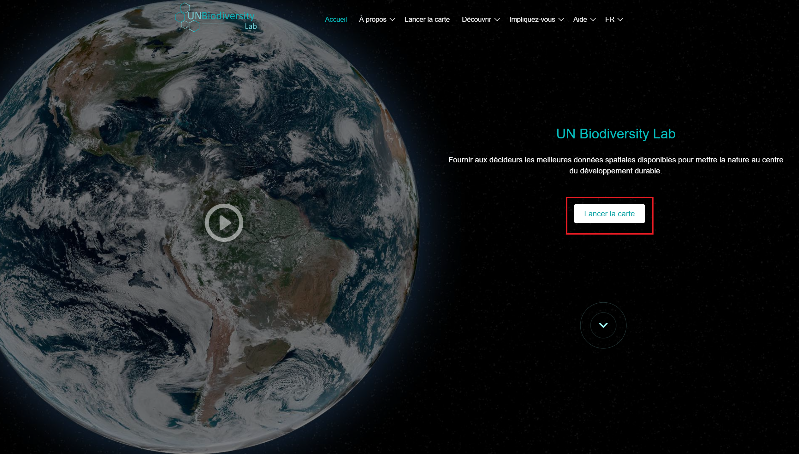
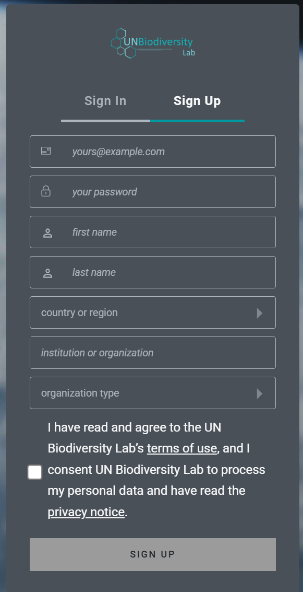
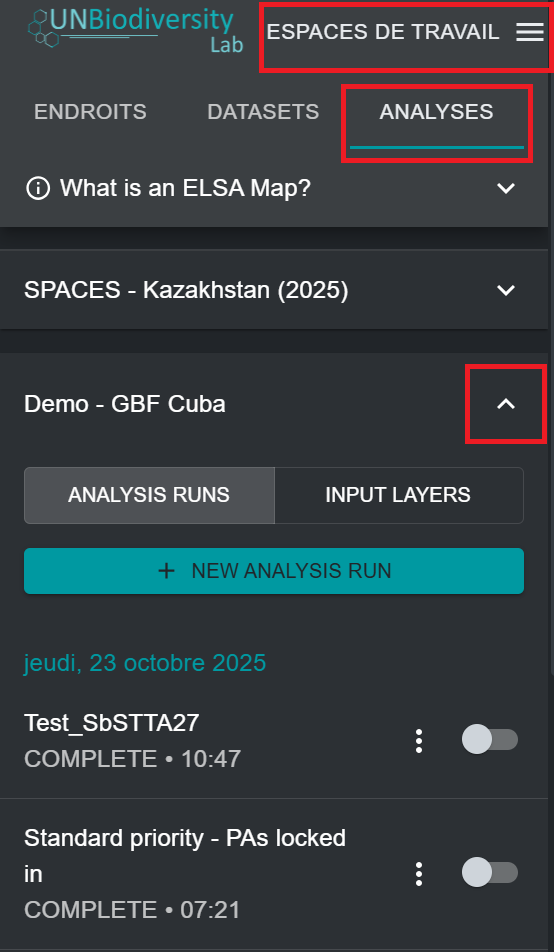

# Inscription sur le UNBL et demande d'accès à un espace de travail avec une configuration de l'outil ELSA

Pour vous inscrire sur le UNBL et demander l'accès à un espace de travail et à l'outil ELSA, veuillez suivre les étapes suivantes.

1. Cliquez sur le bouton « Lancer la carte » sur le site web [du UN Biodiversity Lab](https://unbiodiversitylab.org/en/) pour accéder à l'application de données.

<figure markdown>

<figcaption>Figure 2. Page d'accueil du UNBL</figcaption>
</figure>

2. Une fois la page chargée, cliquez sur l'icône du compte dans le coin supérieur droit et choisissez « S'inscrire ». Entrez votre adresse e-mail, votre nom, votre pays et votre institution (facultatif), puis définissez votre mot de passe pour vous inscrire.

<figure markdown>

<figcaption>Figure 3. Fenêtre d'inscription</figcaption>
</figure>

3. Vous recevrez un e-mail en quelques minutes. Suivez les instructions contenues dans cet e-mail pour vérifier votre compte.
4. Une fois votre compte vérifié, vous pouvez vous connecter à l'aide de votre adresse e-mail et de votre mot de passe, et ce à chaque fois que vous accédez à la plateforme.
5. Pour utiliser l'outil ELSA dans votre pays, il vous suffit de [demander un espace de travail sur le UN Biodiversity Lab](https://unbiodiversitylab.org/fr/unbl-workspaces/) à l'aide de notre formulaire, et d'indiquer que vous souhaitez accéder à l'outil ELSA. N'hésitez pas à nous contacter à [l'adresse support@unbiodiversitylab.org](mailto:support@unbiodiversitylab.org) pour toute question supplémentaire.
6. Une fois l'espace de travail créé, vous recevrez un e-mail de confirmation. Vous pourrez y accéder en vous rendant sur l'application cartographique du UNBL, en basculant l'espace de travail dans l'onglet qui apparaît après avoir cliqué sur l'onglet « ESPACES DE TRAVAIL » en haut à gauche, puis en cliquant sur « ANALYSES » une fois que vous avez choisi votre espace de travail pour afficher l'outil ELSA. Les configurations de l'outil ELSA peuvent être créées pour un ou plusieurs pays au sein de votre espace de travail.
7. Si vous disposez d'une ou plusieurs configurations d'outils dans un seul espace de travail, ou si vous avez accès à plusieurs espaces de travail avec des configurations d'outils, une liste des configurations d'outils disponibles apparaîtra dans l'onglet après avoir cliqué sur « ANALYSES ». Cliquez sur la flèche vers le bas de la configuration d'outil que vous souhaitez utiliser pour sélectionner cette configuration. Si vous n'avez accès qu'à une seule configuration d'outil ou si vous ne disposez que d'un seul espace de travail avec une seule configuration d'outil activée, cette configuration sera automatiquement sélectionnée.

<figure markdown>

<figcaption>Figure 4. Accès à la configuration de l'outil ELSA pour la démonstration GBF - Cuba</figcaption>
</figure>