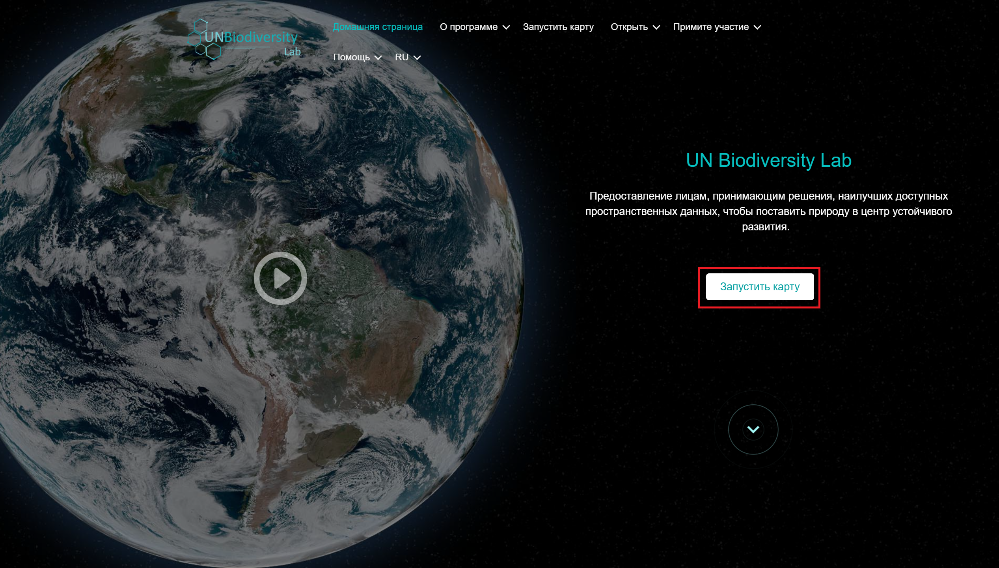
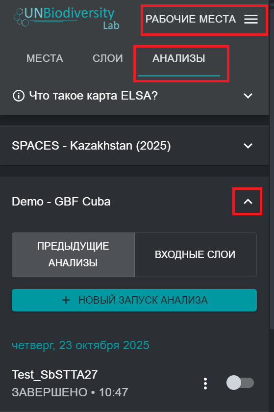

# Регистрация на UNBL и запрос доступа к рабочему пространству с конфигурацией инструмента ELSA

Чтобы зарегистрироваться на UNBL и запросить доступ к рабочему пространству и инструменту ELSA, выполните следующие действия. 

1. Нажмите кнопку «Запустить карту» на веб-сайте [UN Biodiversity Lab](https://unbiodiversitylab.org/ru/), чтобы получить доступ к приложению с данными.

	<figure markdown>
	
	<figcaption>Рисунок 2. Главная страница UNBL</figcaption>
	</figure>

2. После загрузки выберите значок аккаунта в правом верхнем углу и выберите «Зарегистрироваться» (Sign Up). Введите свой адрес электронной почты, имя, страну и учреждение (необязательно) и установите пароль для регистрации. 

	<figure markdown>
	
	<figcaption>Рисунок 3. Окно регистрации</figcaption>
	</figure>

3. Через несколько минут вы получите электронное письмо. Следуйте инструкциям в этом письме, чтобы подтвердить свой аккаунт.
4. После подтверждения аккаунта вы сможете входить в систему, используя свой адрес электронной почты и пароль, каждый раз, когда будете заходить на платформу. 
5. Чтобы использовать инструмент ELSA для вашей страны, просто [запросите рабочее пространство на UNBL](https://unbiodiversitylab.org/ru/unbl-workspaces/), используя нашу форму, и укажите, что вы хотите получить доступ к инструменту ELSA. Если у вас есть дополнительные вопросы, обращайтесь к нам по адресу <support@unbiodiversitylab.org>.
6. После создания рабочего пространства вы получите подтверждение по электронной почте. Вы сможете получить к нему доступ, перейдя в приложение UNBL карты, включив рабочее пространство на вкладке, которая появляется после нажатия на вкладку «РАБОЧИЕ ПРОСТРАНСТВА» в левом верхнем углу, и нажав «АНАЛИЗЫ» после выбора рабочего пространства для просмотра инструмента ELSA. Конфигурации инструмента ELSA могут быть созданы для одной или нескольких стран в вашем рабочем пространстве.  
7. Если у вас есть одна или несколько конфигураций инструмента в одном рабочем пространстве или у вас есть доступ к нескольким рабочим пространствам с конфигурациями инструмента, то после нажатия на «АНАЛИЗЫ» на вкладке появится список доступных конфигураций инструмента. Нажмите на стрелку вниз настройки инструмента, которую хотите использовать, чтобы выбрать эту настройку. Если у вас есть доступ только к одной настройке инструмента или у вас есть только одно рабочее пространство с одной настройкой инструмента, то эта настройка будет выбрана автоматически. 

<figure markdown>

<figcaption>Рисунок 4. Доступ к конфигурации инструмента ELSA для Demo - GBF Куба</figcaption>
</figure>
