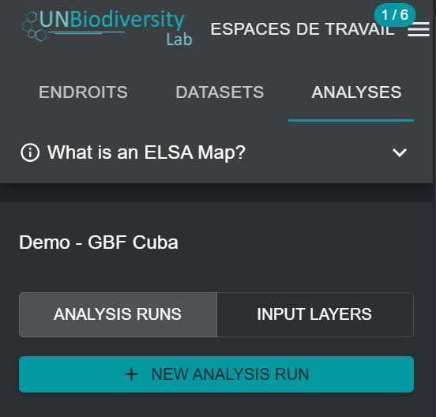

# Création de nouvelles analyses ELSA

Une fois que vous avez sélectionné un outil ELSA spécifique dans le menu déroulant de la figure 4, vous pouvez créer une nouvelle analyse. Pour ce faire, cliquez sur le bouton « NEW ANALYSIS RUN » (NOUVELLE ANALYSE). Une fenêtre contextuelle apparaîtra avec la structure d'optimisation ELSA standard et tous les paramètres ELSA pertinents prêts à être modifiés (voir [Figure 5](#fig-create-new-analysis)).

!!! important
    Les utilisateurs ne peuvent pas créer ni modifier les configurations des outils ELSA. Ils peuvent uniquement créer ou modifier des analyses dans le cadre d'une configuration d'outil ELSA. Pour demander une configuration d'outil ELSA pour un pays spécifique, veuillez contacter <support@unbiodiversitylab.org>.

<figure markdown>
{#fig-create-new-analysis}
<figcaption>Figure 5. Création d'une nouvelle analyse</figcaption>
</figure>