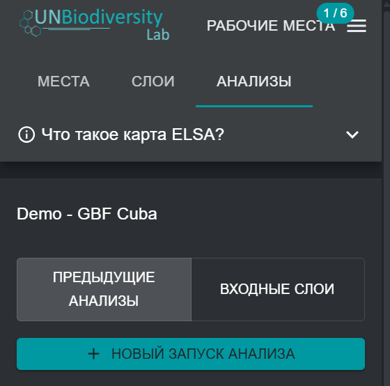

# Создание новых запусков анализа ELSA

После выбора конкретного инструмента ELSA из раскрывающегося списка на рисунке 4 вы можете создать новый запуск анализа. Для этого нажмите кнопку «НОВЫЙ ЗАПУСК АНАЛИЗА ». Появится всплывающее окно с дублированной или стандартной структурой оптимизации пространственной приоритезации со всеми соответствующими компонентами пространственной приоритезации, готовыми к редактированию (см. [Рисунок 5](#fig-create-new-analysis)).

!!! important
    Пользователи не могут создавать или редактировать конфигурации инструментов ELSA. Они могут только создавать или редактировать запуски анализа в рамках конфигурации инструмента ELSA. Чтобы запросить конфигурацию инструмента ELSA для конкретной страны, обратитесь по адресу <support@unbiodiversitylab.org>.

<figure markdown>
{#fig-create-new-analysis}
<figcaption>Рисунок 5. Создание нового анализа</figcaption>
</figure>
