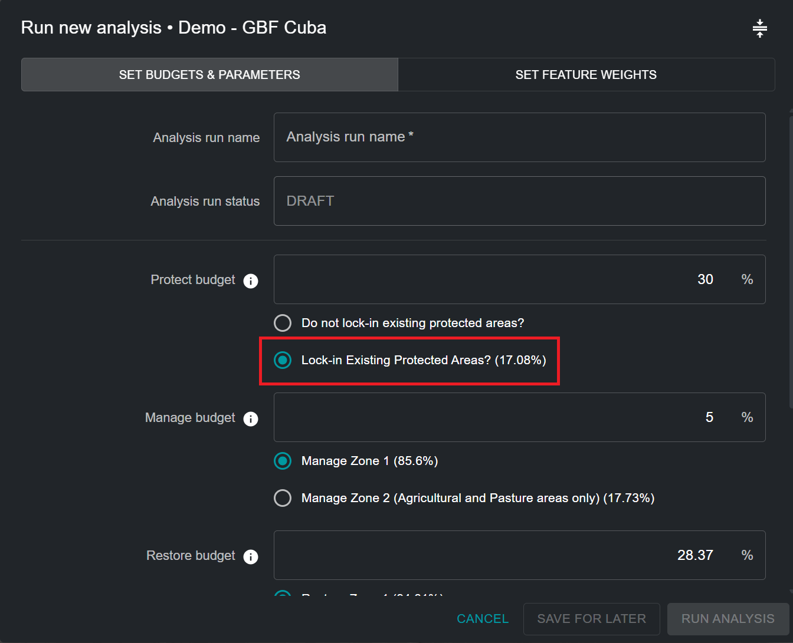
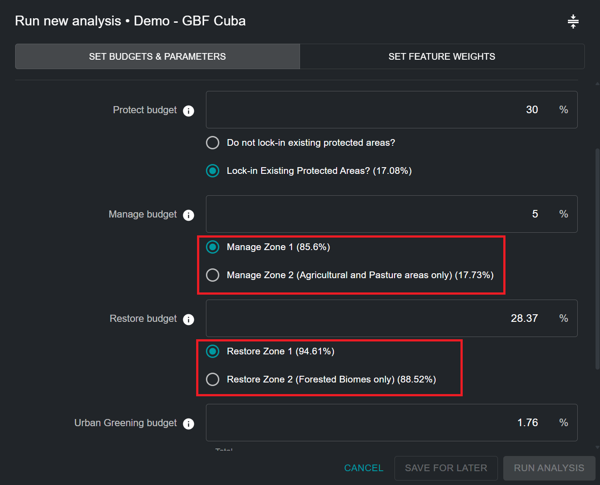
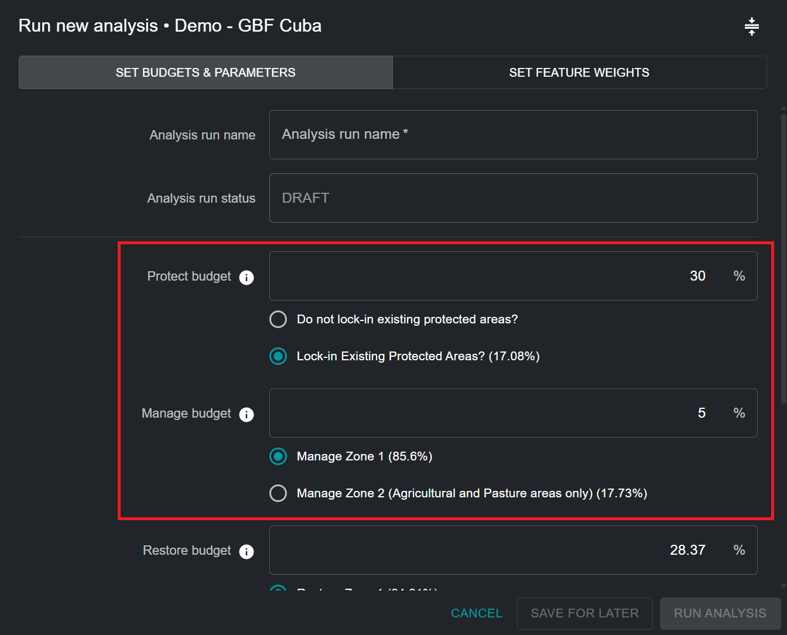
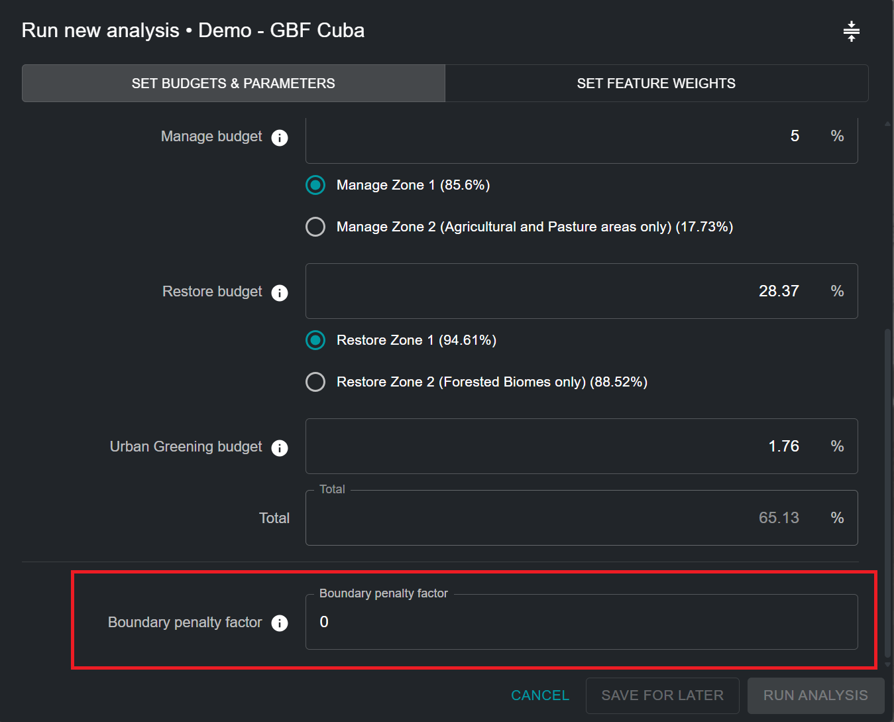
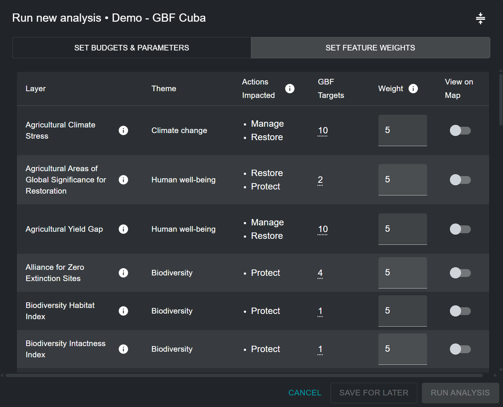
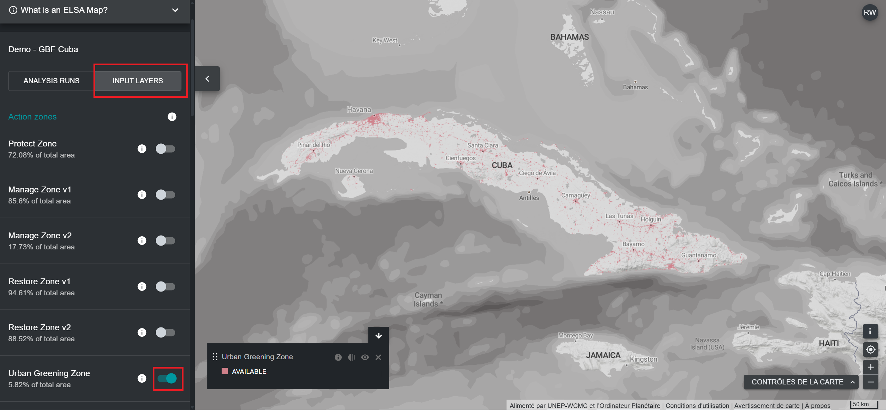
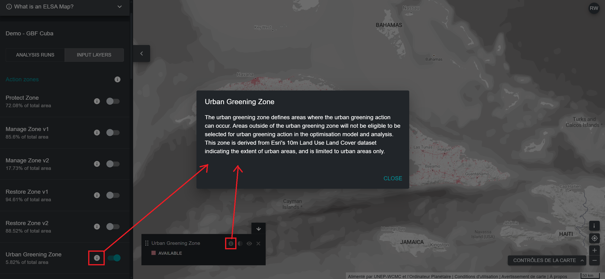

# Modification d'une analyse ELSA

!!! info "Concepts clés"
    * [Zones d'action](12_annex1.md#zones-daction)
    * [Zones de verrouillage](12_annex1.md#zones-de-verrouillage)
    * [Contraintes de zone](12_annex1.md#contrainte-basee-sur-la-superficie)
    * [Facteur de pénalité aux limites](12_annex1.md#facteur-de-penalite-de-limites-bpf)
    * [Caractéristiques de planification](12_annex1.md#caracteristique-de-planification)
    * [Unités de planification](12_annex1.md#unites-de-planification)
    * [Logiciel d'aide à la décision](12_annex1.md#logiciel-daide-a-la-decision)
    * [Système d'information géographique (SIG)](12_annex1.md#systeme-dinformation-geographique-sig)
    * [Restrictions](12_annex1.md#restrictions)
    * [Représentation](12_annex1.md#representation)
    * [Planification systématique de la conservation (PSC)](12_annex1.md#planification-systematique-de-la-conservation-psc)
    * [Interface utilisateur](12_annex1.md#interface-utilisateur)
    * [Pondérations](12_annex1.md#ponderations)

## Nommer une analyse ELSA

En cliquant sur « NOUVELLE ANALYSE » (Figure 5), vous pourrez afficher et modifier une analyse provisoire. Vous devez d'abord donner un nom unique à votre analyse. Bien qu'il n'y ait aucune restriction quant au nom donné à chaque analyse, nous vous suggérons d'utiliser des noms descriptifs, idéalement en référence aux paramètres utilisés (par exemple, inclure des informations telles que "BPF 10" ou "Protect 38%").

## Sélection des fonctions de verrouillage

Vous pouvez vous assurer que certaines zones sont incluses dans votre carte d'action. Conceptuellement, cela s'explique plus facilement comme le verrouillage des zones de planification existantes à l'action de protection sur une carte, reproduisant ainsi les réalités du terrain. Cela oblige à sélectionner ces zones dans l'action de protection sur la carte, et ces zones sont contraintes de contribuer au respect de la contrainte de superficie pour la protection. La couverture nationale des aires protégées (%) est indiquée entre parenthèses. Les configurations de l'outil ne se limitent pas à verrouiller les aires protégées existantes dans l'action de protection (par exemple, il peut être souhaitable de verrouiller les zones de projets de restauration existantes dans l'action de restauration) ; cependant, par défaut, les configurations de l'outil ne permettent actuellement que le verrouillage des aires protégées.

!!! important
    Les aires protégées sont verrouillées *PAR DÉFAUT*

Verrouillage des aires protégées ([Figure 6](#fig-lockin-options)) :

- Sélectionnez « Verrouiller les aires protégées existantes » si vous souhaitez forcer l'analyse à inclure les aires protégées existantes dans l'action « Protection » de la solution.
- Sélectionnez « Ne rien verrouiller » si vous souhaitez évaluer de manière indépendante l'emplacement optimal des aires protégées existantes et nouvelles dans votre pays en fonction des zones « Protéger » sélectionnées dans la carte d'action résultante.

<figure markdown>
{#fig-lockin-options}
<figcaption>Figure 6. Fonctionnalités de verrouillage</figcaption>
</figure>

Comme le montre la [Figure 6](#fig-lockin-options) pour Cuba, les aires protégées existantes couvrent 17,08% du territoire national. Par conséquent, le choix de « Verrouiller les aires protégées existantes » exige qu'au moins 17,08% du territoire national soit affecté à la contrainte « Protéger ».

## Zones alternatives

Les utilisateurs ne peuvent pas définir eux-mêmes les zones, mais pour certaines actions, il peut y avoir à la fois une zone par défaut et une zone alternative qui peuvent être sélectionnées. Par exemple, certains outils peuvent offrir la possibilité de ne prendre en compte que les « zones agricoles » pour l'action de gestion, ou que les « zones forestières » pour l'action de restauration, en fonction des besoins et des priorités individuels des utilisateurs et des pays.

<figure markdown>
{#fig-alt-zone-options}
<figcaption>Figure 7. Zones alternatives pour réduire les zones d'activité fondées sur la nature</figcaption>
</figure>

## Définition de contraintes basées sur la zone pour les actions

Cette partie de l'outil vous permet de définir des contraintes (cibles) basées sur la superficie pour la protection, la restauration, la gestion et/ou le verdissement urbain. Les contraintes territoriales peuvent également être comprises comme le pourcentage de superficie qui devrait être attribué à chaque action dans la carte d'action qui en résulte. Les valeurs par défaut dans tout outil ELSA sont dérivées des cibles terrestres du KMGBF, à moins qu'elles ne soient personnalisées pour votre pays par l'équipe UNBL sur la base de votre Stratégie et plan d'action nationaux pour la biodiversité (SPANB) ou d'autres documents politiques nationaux.

!!! Attention "Veuillez noter les différents types d'actions disponibles dans l'outil ELSA et les politiques qui leur sont associées :"
	| Action par défaut | Cible KMGBF | Hiérarchie des réponses LDN de la CNULCD |
	|----------------|--------------|------------------------------|
	| Protéger | Cible 3 | Eviter |
	| Restaurer | Cible 2 | Inverser |
	| Gérer | Cible 10 | Réduire |
	| Verdissement urbain | Cible 12 | N/A |

	Les mesures mentionnées ici sont l'équivalent fonctionnel des mesures de la hiérarchie des réponses LDN soutenues par la CNULCD. « Protéger » équivaut à « éviter » la dégradation des terres, « gérer » équivaut à « réduire » la dégradation des terres et « restaurer » équivaut à « inverser » la dégradation des terres. En résumé, cela équivaut à « Protéger-Gérer-Restaurer » avec « Éviter-Réduire-Inverser », garantissant ainsi l'alignement entre les cadres mondiaux en matière de biodiversité. Pour plus d'informations sur chaque objectif du KMGBF, veuillez consulter le [site web de la CDB](https://www.cbd.int/gbf/targets). Pour plus d'informations sur la hiérarchie des mesures LDN, consultez le [site web de la CNULCD](https://www.unccd.int/land-and-life/land-degradation-neutrality/overview).

Vous pouvez définir n'importe quelle valeur supérieure ou égale à 0,001 pour les objectifs de protection, de restauration, de gestion, et/ou de verdissement urbain. La somme des valeurs pour tous les objectifs peut être inférieure ou égale à 100%, mais ne doit pas dépasser 100%. De plus, la valeur maximale pour une contrainte de zone unique ne peut pas dépasser la superficie totale de cette zone d'action. Par exemple, si 80% d'un pays est couvert par une zone de protection, la valeur maximale pouvant être attribuée à la contrainte de protection basée sur la superficie ne peut pas dépasser 80%. Si vous entrez un nombre trop élevé, vous recevrez un message d'erreur indiquant le montant maximal pouvant être attribué.

!!! note
    L'emplacement et la superficie totale de chaque zone d'action définissent les endroits où chaque action peut être mise en œuvre. Ils sont déterminés en fonction du type d'écosystème et du niveau de développement d'un pays (par exemple, la protection ne peut pas être mise en œuvre dans les zones où l'indice industriel humain est élevé).

Vous devez également tenir compte du fait que si vous souhaitez verrouiller les aires protégées existantes (par défaut), la contrainte globale de la zone de protection doit être égale ou supérieure à la superficie couverte par les aires protégées existantes. Par exemple, la superficie couverte par les aires protégées existantes au Kazakhstan est de 17,08%. Par conséquent, la contrainte de la zone de protection doit être égale ou supérieure à 17,08%.

<figure markdown>
{#fig-setting-objectives}
<figcaption>Figure 8. Définition des objectifs</figcaption>
</figure>

## Spécification du facteur de pénalité de limites

Le facteur de pénalité de limites est utilisé pour favoriser la cohésion spatiale lors de la priorisation des zones d'utilisation des sols. La pénalité de limites peut être égale à 0 ou supérieure. Plus la valeur est élevée, plus les zones d'action seront connectées et contiguës sur la carte. Cet ajustement repose sur l'idée que, dans la réalité, une zone plus connectée est généralement plus facile à gérer et à mettre en œuvre.

Étapes :

1. Pour définir la pénalité de limite, commencez par un petit nombre, par exemple 10.
2. Augmentez le nombre de manière itérative, c'est-à-dire en relançant l'analyse à plusieurs reprises, par ordre de grandeur (par exemple, 10 -> 100 -> 1000), en réduisant le taux d'augmentation à mesure que vous vous approchez des solutions qui mènent au niveau de regroupement souhaité. Chaque fois que vous modifiez la pénalité, vous devrez relancer l'optimisation jusqu'à obtenir une carte suffisamment contiguë pour répondre à vos besoins.

!!! attention
    L'augmentation du facteur de pénalité de limite à partir de 0 entraînera des temps de résolution plus longs ; dans certains cas, ceux-ci peuvent être beaucoup plus longs.

<figure markdown>
{#fig-adjust-bpf}
<figcaption>Figure 9. Ajustement du facteur de pénalité de limite</figcaption>
</figure>

## Modification des pondérations des caractéristiques de planification

Pour modifier les pondérations des caractéristiques de planification, cliquez sur le bouton « SET FEATURE WEIGHTS » (Définir les pondérations des caractéristiques) situé dans le coin supérieur droit de la fenêtre contextuelle d'analyse.

Vous devez saisir une pondération pour chaque caractéristique de planification dans la liste des données d'entrée. Nous recommandons une échelle de 0 à 10, comme suit, en fonction du niveau de priorité de chaque caractéristique de planification et de votre confiance dans l'exactitude de l'ensemble de données pour votre pays :

- 0 - sans importance / exclu de l'analyse
- 1,0 - faible importance / importance inférieure à la moyenne
- 5,0 - importance moyenne
- 10 - importance capitale

Afin de permettre aux utilisateurs de prendre la décision la plus éclairée possible, le thème (biodiversité/changement climatique/bien-être humain), les actions pertinentes et l'objectif politique KMGBF proxy (ou autre objectif SPANB/politique nationale pertinent) sont répertoriés pour chaque élément de planification. Vous pouvez évaluer le niveau de priorité de chaque élément de planification et attribuer une pondération éclairée en décidant de l'importance relative de chacun des éléments de planification utilisés pour cartographier les objectifs KMGBF (ou d'autres objectifs pertinents de la SPANB/politique nationale autrement définis par votre pays) dans votre pays. Par exemple, si l'objectif 1 du KMGBF revêt une importance particulière pour votre pays, les caractéristiques de planification telles que les écosystèmes intacts, les forêts à haute intégrité, l'indice d'habitat de la biodiversité, et l'indice d'intégrité de la biodiversité devraient se voir attribuer une pondération plus élevée (> 3). À l'inverse, si vous estimez que les écosystèmes menacés de votre pays sont particulièrement dégradés, et devraient être pris en compte pour identifier les zones prioritaires à restaurer pour l'objectif 2 du KMGBF, vous pouvez accorder une pondération plus élevée à l'élément de planification « Écosystèmes menacés à restaurer », qui cartographie spécifiquement ces zones (voir [Figure 10](#fig-edit-weights)).

Pour obtenir la liste complète des données d'entrée, ainsi que les cibles KMGBF pour lesquelles elles sont utilisées, veuillez consulter l'[Annexe 2](13_annex2.md).

<figure markdown>
{#fig-edit-weights}
<figcaption>Figure 10. Modification des pondérations</figcaption>
</figure>

## Afficher les couches d'entrée

Si vous souhaitez afficher les fonctionnalités de planification avant de définir les pondérations, vous devez quitter la fenêtre contextuelle en cliquant sur « ENREGISTRER POUR PLUS TARD » dans le coin inférieur droit. Vous pouvez ensuite revenir à votre analyse préliminaire enregistrée après avoir affiché les fonctionnalités de planification souhaitées.

Pour afficher les fonctionnalités de planification, cliquez sur l'option « INPUT LAYERS » (COUCHES D'ENTRÉE) à côté de l'option « ANALYSIS RUNS » (EXÉCUTIONS D'ANALYSE) dans l'onglet d'outils de gauche. Vous pouvez ensuite basculer entre les couches d'entrée spécifiques pour les afficher dans le UNBL.

<figure markdown>

<figcaption>Figure 11. Affichage des zones d'action et des fonctionnalités de planification sur le UNBL</figcaption>
</figure>

En cliquant sur l'onglet « INPUT LAYERS » (COUCHES D'ENTRÉE), vous pouvez afficher chaque couche de fonctionnalités de planification d'entrée individuelle incluse dans l'analyse ELSA ; ces entrées sont spécialement conçues pour aider à identifier les zones prioritaires pour la mise en œuvre du KMGBF, ainsi que la mise en œuvre de la SPANB/d'autres politiques nationales, si votre pays en fait la demande expresse. Vous pouvez également afficher (facultatif) les fonctionnalités verrouillées (à savoir les aires protégées existantes) dans votre pays. Enfin, vous pouvez afficher la couche correspondant à chaque zone d'action qui définit où il est possible de mener chaque action dans votre pays pour l'analyse.

Étapes :

1. Cliquez sur le bouton bascule pour chaque zone d'action/zone verrouillée/couche cartographique de planification des données que vous souhaitez afficher.
2. Cliquez à nouveau sur le bouton pour supprimer la couche sélectionnée de l'affichage.
3. Vous avez la possibilité d'afficher des informations supplémentaires (description de la couche, couches d'entrée d'origine, source) pour les couches actuellement activées en cliquant sur l'icône ronde « **i** » dans la légende de chaque couche ou à côté du bouton d'activation de chaque couche.

<figure markdown>

<figcaption>Figure 12. Affichage des métadonnées</figcaption>
</figure>
