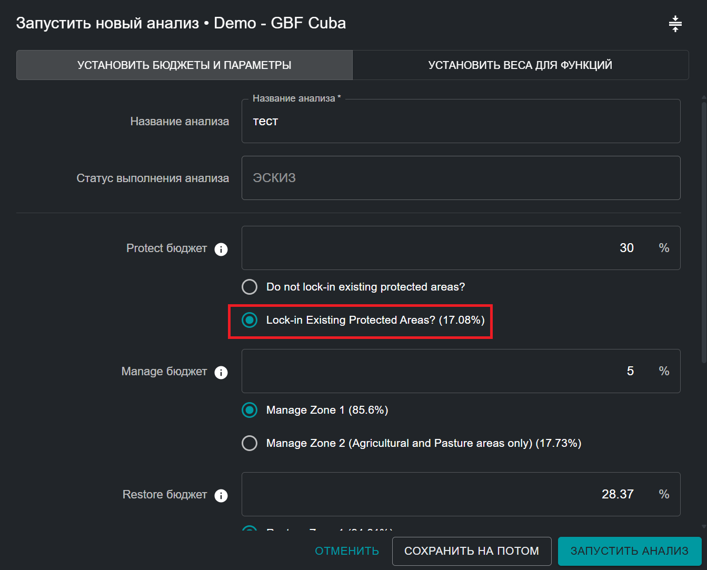
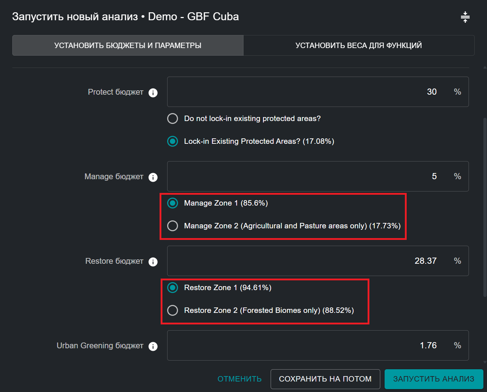
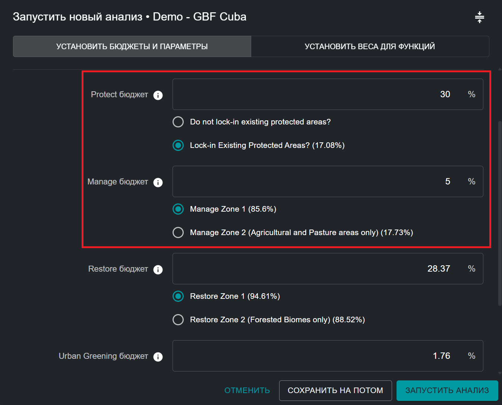
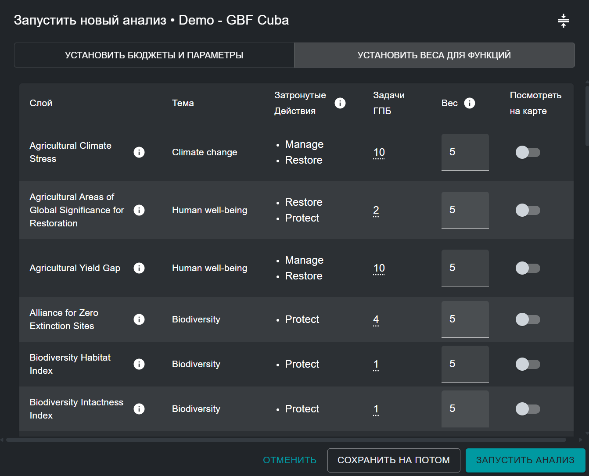
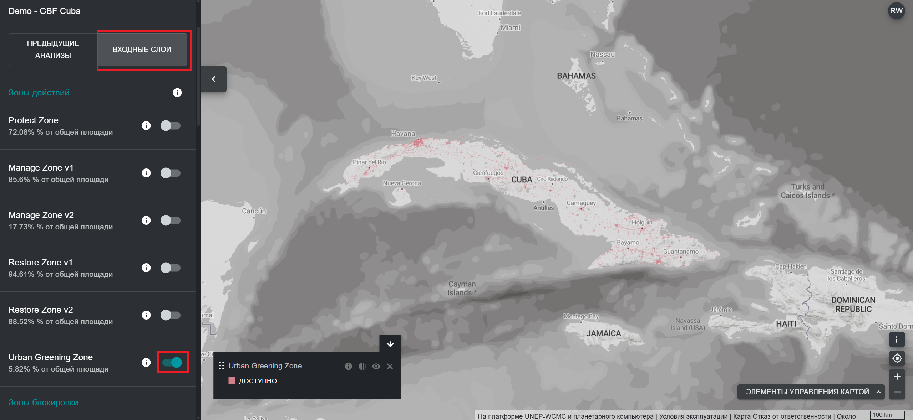
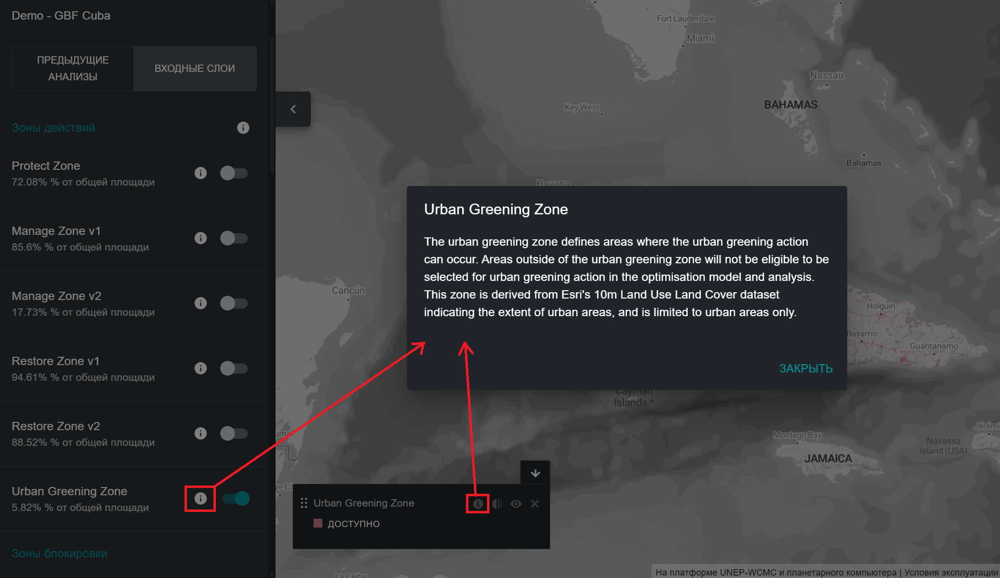

# Редактирование запуска анализа ELSA

!!! info "Ключевые концепции"
    * [Зоны ограничения действий](12_annex1.md#action-zones)
    * [Характеристики закрепления](12_annex1.md#lock-in-features)
    * [Ограничение на основе площади](12_annex1.md#area-based-constraint)
    * [Коэффициент граничного штрафа (BPF)](12_annex1.md#boundary-penalty-factor-bpf)
    * [Планировочный элемент](12_annex1.md#planning-feature)
    * [Планировочные единицы](12_annex1.md#planning-units)
    * [Программное обеспечение для поддержки принятия решений](12_annex1.md#decision-support-software)
    * [Географическая информационная система (ГИС)](12_annex1.md#geographic-information-system-gis)
    * [Ограничения](12_annex1.md#restrictions)
    * [Представление](12_annex1.md#representation)
    * [Систематическое планирование природоохранных действий (SCP)](12_annex1.md#systematic-conservation-planning-scp)
    * [Пользовательский интерфейс](12_annex1.md#user-interface)
    * [Веса](12_annex1.md#weights)

## Название анализа ELSA

После нажатия кнопки «Дублировать» или «НОВЫЙ ЗАПУСК АНАЛИЗА» (рисунок 5) пользователи смогут просматривать и редактировать предварительный анализ. Во-первых, пользователи должны присвоить новому анализу уникальное имя. Хотя нет никаких ограничений на имена, присваиваемые каждому анализу, мы рекомендуем, чтобы имена анализов включали значимые описания, в идеале со описанием о использованных параметрах (например, включая такую информацию, как BPF 10 или Защита 38%). 

## Выбор вариантов блокировки

Вы можете заблокировать/зафиксировать определенные территорий в карту приоритетных областей. Концептуально это проще всего понять как фиксацию существующих территорий планирования в действии по охране природы на карте — по сути, воспроизведение реальности на местности. Это заставляет выбирать эти территории в рамках определенного действия на карте, и эти территории вынуждены вносить вклад в выполнение ограничений по площади для действия. Покрытие национальных охраняемых территорий (%) указано в скобках. Настройки инструмента не ограничиваются только фиксацией существующих охраняемых территорий в рамках мер по охране (например, может быть целесообразно зафиксировать существующие территории проектов по восстановлению в рамках действий по восстановлению); однако по умолчанию настройки инструмента в настоящее время конфигурированы только для фиксации охраняемых территорий.  

!!! important "ПРИМЕЧАНИЕ"
    Охраняемые территории заблокированы **ПО УМОЛЧАНИЮ**

Блокировка охраняемых территорий ([Рисунок 6](#fig-lockin-options)):

* Выберите «Блокировать существующие охраняемые территории», если вы хотите, чтобы анализ включал существующие охраняемые территории в рамках действия «Охрана» в решении. 
* Выберите «Не блокировать ничего», если вы хотите независимо оценить оптимальное расположение существующих и новых охраняемых территорий в вашей стране на основе территорий по действию «Охрана», выбранных в итоговой карте приоритетных областей. 

<figure markdown>
{#fig-lockin-options}
<figcaption>Рисунок 6. Варианты блокировки</figcaption>
</figure>

Как видно на [Рисунке 6](#fig-lockin-options) для Кубы, существующие охраняемые территории занимают 17,08 % территории страны. Поэтому выбор варианта «Блокировка существующих охраняемых территорий» требует, чтобы не менее 17,08 % территории страны было отнесено к действию по «Охране». 

## Альтернативные зоны

Пользователи не могут самостоятельно определять зоны, но для некоторых действий может быть как зона по умолчанию, так и альтернативная зона, которую можно выбрать. Например, некоторые инструменты могут иметь опцию «Только сельскохозяйственные угодья» для действия «Управление» или «Только лесные угодья» для действия «Восстановление» в зависимости от индивидуальных потребностей и приоритетов пользователей и стран. 

<figure markdown>
{#fig-alt-zone-options}
<figcaption>Рисунок 7. Альтернативные зоны</figcaption>
</figure>

## Указание ограничений/бюджетов

Эта часть инструмента позволяет устанавливать бюджеты (также цели или ограничения) для охраны, восстановления, управления и/или озеленения городов на основе площади страны. Бюджеты также можно понимать как процент площади земель, который может быть выделен для каждого действия в пределах страны. Значения по умолчанию в любом инструменте ELSA взяты из наземных целей ГПБ, если они не были дополнительно настроены для вашей страны командой UNBL на основе вашей Национальной стратегии и плана действий в области биоразнообразия (NBSAP) или других национальных политических документов. 

!!! warning "Обратите внимание на различные типы действий, доступных в инструменте ELSA, и связанные с ними политики:"
	| Действие | Задача ГПБ | Иерархия мер LDN от UNCCD |
	|----------------|--------------|------------------------------|
	| Защита | Задача 3 | Избежание |
	| Восстановление | Задача 2 | Обратить вспять |
	| Управление | Задача 10 | Уменьшение |
	| Озеленение городов | Задача 12 | N/A |
	
	Указанные здесь действия являются функциональным эквивалентом действий иерархии мер по борьбе с деградацией земель, поддерживаемой в рамках UNCCD. «Защита» эквивалентна «избежанинию» деградации земель, «управление» эквивалентно «уменьшению» деградации земель, а «восстановление» эквивалентно «обращению вспять» деградации земель. Таким образом, «охранять–управлять–восстанавливать» приравнивается к «предотвращать–уменьшать–обращать вспять», что обеспечивает согласованность глобальных рамок в области биоразнообразия. Для получения дополнительной информации о каждой цели ГПБ см. [Веб-сайт КБР](https://www.cbd.int/gbf/targets). Для получения дополнительной информации об иерархии мер LDN см. [Веб-сайт UNCCD](https://www.unccd.int/land-and-life/land-degradation-neutrality/overview).

Пользователи могут установить любой бюджет, большее или равное 0,001, для выделения приоритетных областей для действий по охране, восстановлению, управлению и/или озеленению городов. Сумма значений для всех целей может быть меньше или равна 100%, но не должна превышать 100%. Сумма бюджетов для всех действий может быть меньше или равна 100%, но не должна превышать 100%. Кроме того, значение бюджета не может превышать общую площадь земель, охватываемых зоной, которая пространственно ограничивает любое конкретное действие. Например, если 80% территории страны покрыто зоной охраны, то максимальный бюджет, который может быть назначен для ограничения по площади для охраны, не может превышать 80%. Если вы введете слишком высокое число, вы получите сообщение об ошибке с указанием максимального количества, которое может быть выделено.   

!!! note "ПРИМЕЧАНИЕ"
    Местоположение и общая площадь каждой зоны действия определяют, где возможно осуществление каждого действия. Это определяется на основе типа экосистемы и уровня развития страны (например, охрана не может осуществляться в районах с высоким индексом человеческого воздействия).

Вы также должны учитывать, что если вы хотите зафиксировать существующие охраняемые территории (по умолчанию), общее ограничение по площади охраняемой территории должно быть равно или превышать площадь земель, покрытых существующими охраняемыми территориями. Например, площадь земель, покрытых существующими охраняемыми территориями в Кубе, составляет 17,08%. Поэтому ограничение по площади охраняемой территории должно быть равно или превышать 17,08%. 

<figure markdown>
{#fig-setting-objectives}
<figcaption>Рисунок 8. Установление бюджетов</figcaption>
</figure>

## Указание коэффициента граничного штрафа

Коэффициент штрафа за границу используется для содействия пространственной сплоченности при определении приоритетных областей для охраны, восстановлению, управлению или озеленению городов. Штраф за границу может быть равен 0 или выше. Чем выше значение, тем более связанными и смежными будут области приоритетных действий на карте. Эта корректировка основана на идее, что в реальном планировании более связанная зона обычно легче управляется и позволяет легче выполнять действия. 

Шаги:

1. Чтобы установить штраф за границу, начните с небольшого числа, например, 10.
2. Постепенно увеличивайте число, т. е. повторно запускайте анализ, на порядок (например, 10 -> 100 -> 1000), уменьшая темп увеличения по мере приближения к решениям, которые приводят к желаемому уровню кластеризации. Каждый раз, когда вы изменяете штраф, вам придется повторно запускать оптимизацию, пока вы не получите карту, которая будет достаточно непрерывной для удовлетворения ваших потребностей. 

!!! attention "ПРИМЕЧАНИЕ"
    Увеличение коэффициента граничного штрафа с 0 приведет к увеличению времени решения; в некоторых случаях оно может значительно увеличиться. 

<figure markdown>
{#fig-setting-objectives}
<figcaption>Рисунок 9. Настройка коэффициента граничного штрафа</figcaption>
</figure>

## Редактирование весов планировочных элементов

Чтобы отредактировать веса планировочных элементов, нажмите кнопку «УСТАНОВИТЬ ВЕСА ДЛЯ ФУНКЦИЙ» в правом верхнем углу всплывающего окна запуска анализа.

Пользователи должны ввести вес для каждого планировочного элемента в списке входных данных. Мы рекомендуем использовать шкалу от 0 до 10 в зависимости от уровня приоритетности каждого планировочного элемента: 

* 0 - не важно / не рассматривается
* 1,0 - низкая важность / важность ниже средней
* 5,0 - средняя важность
* 10 - крайне важно 

Чтобы пользователи могли принять наиболее обоснованное решение, для каждого элемента планирования указаны тема (биоразнообразие/изменение климата/благосостояние человека), соответствующие действия и прокси-цель политики ГПБ (или другая соответствующая цель NBSAP/национальной политики). Вы можете оценить уровень приоритетности каждого элемента планирования и присвоить ему весовой коэффициент, определив относительную важность каждого из элементов планирования, используемых для отображения целей ГПБ (или других соответствующих целей NBSAP/национальной политики, определенных вашей страной). Например, если цель ГПБ 1 имеет особое значение для вашей страны, то таким элементам планирования, как нетронутые экосистемы, леса с высокой степенью целостности, индекс биоразнообразия среды обитания и индекс целостности биоразнообразия, следует присвоить более высокий вес (> 3). В качестве альтернативы, если вы считаете, что экосистемы, находящиеся под угрозой в вашей стране, особенно деградированы и должны быть учтены при определении приоритетных областей для восстановления в соответствии с целью ГПБ 2, то вы можете придать более высокий вес элементу планирования «Экосистемы, находящиеся под угрозой, для восстановления», который специально отображает эти области (см. [Рисунок 10](#fig-edit-weights)).

Полный список входных данных, использованных как планировочные элементы, а также целей ГПБ к которуму каждый элемент связан, см. [Приложение 2](13_annex2.md).

<figure markdown>
{#fig-edit-weights}
<figcaption>Рисунок 10. Редактирование весов</figcaption>
</figure>

## Просмотр входных слоев

Пользователи должны учитывать, что если они хотят просмотреть входные слои перед установкой весов, им необходимо выйти из всплывающего окна первоначального анализа, нажав «СОХРАНИТЬ НА ПОТОМ» в правом нижнем углу. Затем они могут вернуться к сохраненному черновому анализу после просмотра нужных входных объектов. 

Чтобы просмотреть исходные входные слои в стеке данных для инструмента, пользователи могут нажать на опцию «ВХОДНЫЕ СЛОИ» рядом с опцией «ПРОГОНЫ АНАЛИЗА» на левой вкладке инструмента. Затем пользователи могут переключать определенные входные слои, чтобы просмотреть их в UNBL. 

<figure markdown>

<figcaption>Рисунок 11. Просмотр зон ограничения действий и планировочных элементов в UNBL</figcaption>
</figure>

Нажав на вкладку « ВХОДНЫЕ СЛОИ », вы можете просмотреть каждый отдельный входной слой элементов планирования, включенный в анализ ELSA; эти входные данные специально разработаны для помощи в определении приоритетных областей для реализации ГПБ, а также NBSAP/других национальных политик, если это специально запрошено вашей страной. Вы также можете просмотреть (по желанию) варианты блокировки (а именно, существующие охраняемые территории) в вашей стране. Наконец, вы можете просмотреть слой для каждой зоны действий, который определяет, где в вашей стране возможно осуществление каждого действия для анализа. 

Шаги:

* Нажмите кнопку переключения для каждого слоя зоны ограничении действия/зоны функции блокировки/входного планировочного элемента, который вы хотите отобразить.
* Нажмите кнопку переключения еще раз, чтобы удалить выбранный слой из просмотра. 
* Пользователи могут просматривать дополнительную информацию (описание слоя, исходные входные слои, источник) для текущих слоев, нажав на круглую иконку **«i»** в легенде отдельного слоя или рядом с кнопкой переключения для каждого слоя.

<figure markdown>

<figcaption>Рисунок 12. Просмотр метаданных</figcaption>
</figure>
