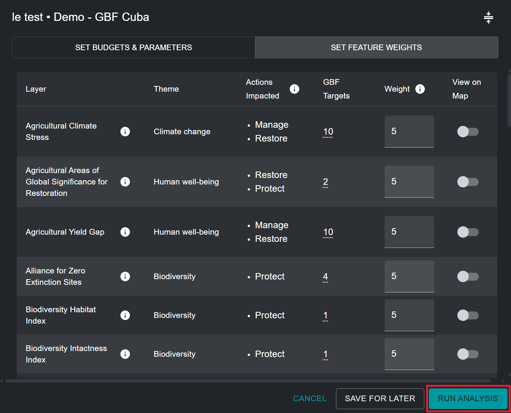
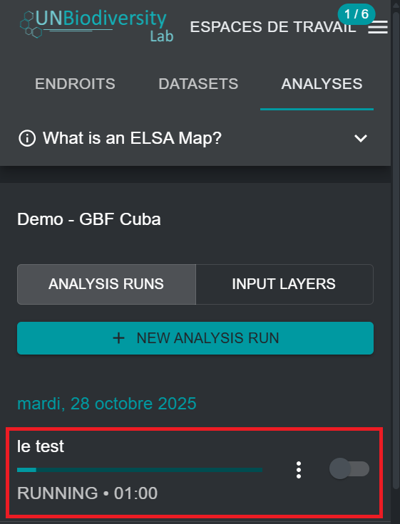

# Exécution de l'optimisation

Pour créer une carte d'action indiquant les zones prioritaires pour la mise en œuvre des objectifs 1 à 12 du KMGBF, l'optimisation exécutée par l'outil suit trois règles strictes:

- Elle ne doit pas dépasser les contraintes sélectionnées basées sur la zone ;
- Elle doit inclure les zones verrouillées sélectionnées ; et
- Elle doit inclure les zones qui représentent le mieux les caractéristiques de planification en fonction de leur répartition spatiale et de leur pondération.

Une fois que vous avez nommé votre analyse, défini les contraintes basées sur la zone, verrouillé les fonctionnalités, défini un facteur de pénalité de limite et modifié les pondérations des caractéristiques de planification, l'analyse est prête à être exécutée. Pour ce faire, cliquez sur le bouton bleu « EXÉCUTER L'ANALYSE » dans le coin inférieur droit de la fenêtre contextuelle de l'analyse. Notez que ce bouton ne sera disponible pour cliquer et exécuter qu'une fois que tous les paramètres pertinents auront été renseignés.

<figure markdown>

<figcaption>Figure 13. Exécuter l'analyse</figcaption>
</figure>

L'analyse peut prendre entre une et cinq minutes. Cependant, si le pays est grand, si de nombreuses fonctionnalités de planification sont utilisées, ou si un facteur de pénalité de frontière élevé est appliqué, cela peut prendre beaucoup plus de temps. Une barre de progression vous indiquera l'état d'avancement de l'analyse. Nous vous déconseillons d'exécuter une deuxième analyse ELSA avant que la première analyse ne soit terminée. Une fois que la barre de progression a atteint 100%, et que l'analyse a été exécutée, vous pouvez consulter le résultat de votre analyse dans l'onglet gauche sous « ANALYSE EXÉCUTÉE ».

## Étapes suivantes

Les chapitres suivants détaillent comment vous pouvez consulter, évaluer et analyser les résultats de votre analyse ELSA. Si vous souhaitez modifier les paramètres de votre analyse et exécuter une nouvelle analyse après avoir évalué les résultats, vous pouvez dupliquer une analyse précédente, la modifier et créer une nouvelle version.

<figure markdown>

<figcaption>Figure 14. Analyse ELSA en temps réel</figcaption>
</figure>