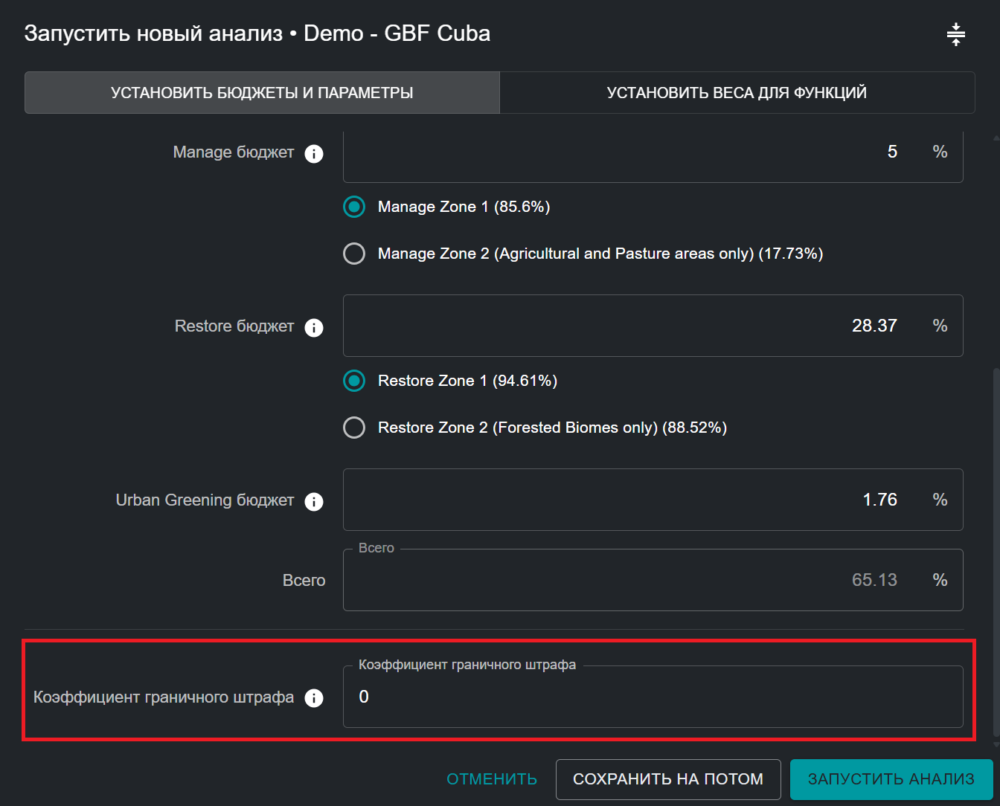
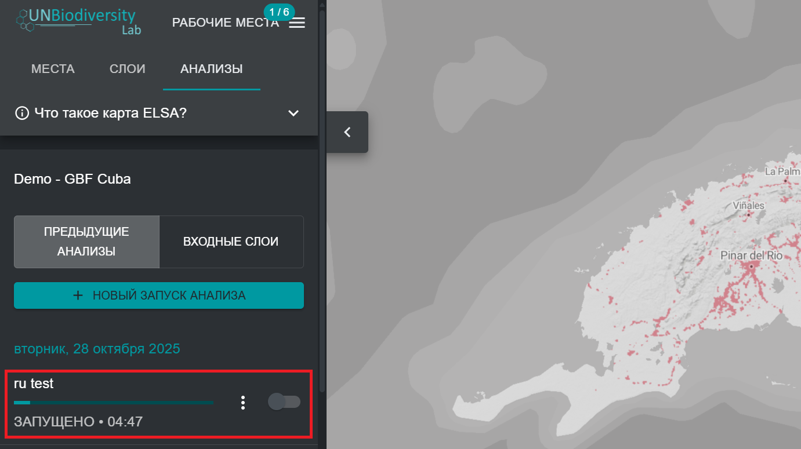

# Запуск оптимизации

Для создания карты действий, показывающей приоритетные области для реализации целей ГПБ 1-12, оптимизация, выполняемая инструментом, следует трем жёстко запрограммированным правилам: 

* Она не должна превышать выбранные площадочные бюджеты; 
* Она должна включать выбранные функции блокировки или неблокировки; 
* Она должна включать оптимальное сочетание планировочных элементов на основе распределения и взвешивания планировочных элементов. 

После того как пользователи назвали свой анализ, установили бюджеты, функции блокировки и коэффициент граничного штрафа, а также отредактировали веса планировочных элементов, анализ готов к выполнению. Это можно сделать, нажав синюю кнопку «ЗАПУСТИТЬ АНАЛИЗ» в правом нижнем углу всплывающего окна анализа. Пользователи должны иметь в виду, что эта кнопка станет доступной для нажатия и выполнения только после того, как будут заполнены все соответствующие параметры. 

<figure markdown>

<figcaption>Рисунок 13. Запуск анализа</figcaption>
</figure>

Анализ может занять от 1 до 5 минут. Однако, если страна большая (что приводит к большему количеству единиц планирования), используется много элементов планирования или применяется высокий коэффициент граничного штрафа, это может занять гораздо больше времени. Вы должны увидеть индикатор выполнения, отображающий статус анализа. Не рекомендуется запускать второй анализ, пока выполняется другой. Как только индикатор выполнения достигнет 100% и анализ будет выполнен, пользователь сможет просмотреть результат своего нового анализа в виде самой последней записи, отображаемой на левой вкладке в разделе «АНАЛИЗЫ». 

## Следующие шаги

В следующих главах будет подробно описано, как пользователь может просматривать, оценивать и анализировать результаты своего анализа пространственной приоритезации. Если пользователь желает изменить параметры своего анализа и выполнить новый запуск после оценки результатов, он может дублировать свой анализ и отредактировать его, чтобы создать новую версию. 

<figure markdown>

<figcaption>Рисунок 14. Выполнение анализа ELSA</figcaption>
</figure>
