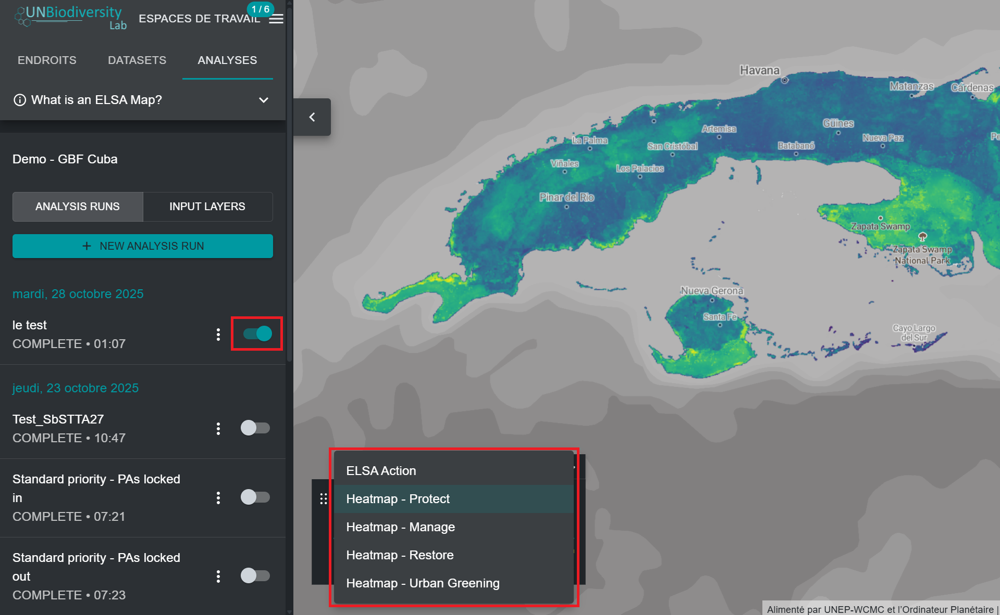
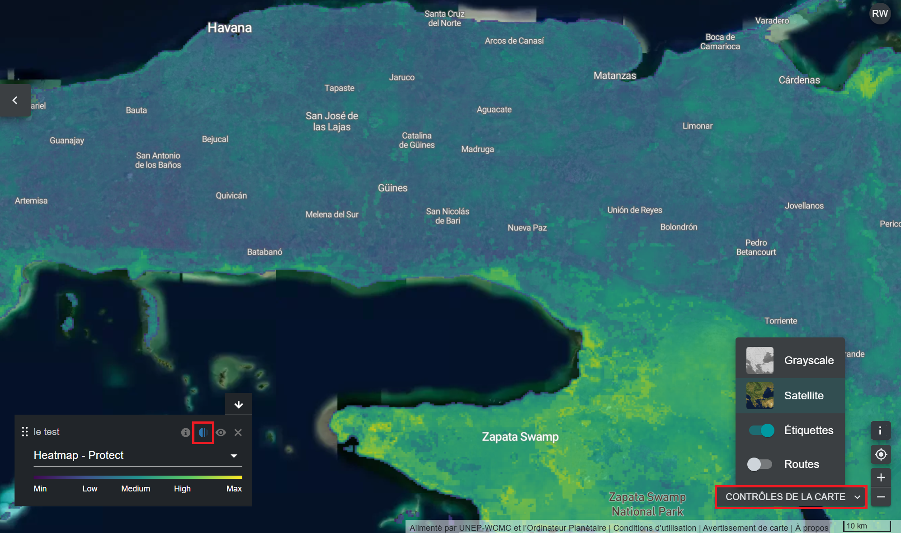

# Affichage des heatmaps

Après avoir exécuté une analyse ELSA, vous pourrez afficher les résultats en cliquant sur les trois points verticaux à côté de l'entrée d'analyse dans l'onglet de gauche, puis en cliquant sur le bouton « Afficher ». Dans le menu déroulant de la légende qui apparaît sur la carte, vous pouvez choisir d'afficher la carte d'actions finale, ou les couches de la heatmap. Nous vous suggérons de commencer par afficher les heatmaps.

<figure markdown>
{#fig-viewing-hm}
<figcaption>Figure 15. Affichage des couches de la heatmap</figcaption>
</figure>

Les heatmaps identifient les emplacements importants pour atteindre les objectifs KMGBF 1 à 12, ou d'autres objectifs politiques spécifiés par votre pays. Elles correspondent à la somme normalisée des valeurs des caractéristiques de planification dans chaque unité, en tenant compte des pondérations attribuées par l'utilisateur à chaque caractéristique de planification. Les zones importantes (où les caractéristiques de planification sont plus nombreuses, après ajustement en fonction de la pondération) sont représentées par une gamme de couleurs allant du vert au jaune, les zones en jaune vif étant les plus importantes. Les informations contenues dans les heatmaps peuvent être utilisées pour identifier les zones où la contribution globale des caractéristiques de planification à l'un des objectifs 1 à 12 du KMGBF est la plus importante.

En évaluant les heatmaps, les experts en données peuvent consulter les données agrégées pondérées par les utilisateurs relatives aux caractéristiques d'aménagement, afin de déterminer si les modèles correspondent à leurs attentes et à leur connaissance personnelle de la région. Pour faciliter ce processus, les utilisateurs peuvent basculer entre les heatmaps et les images satellites/cartes routières/cartes des caractéristiques d'aménagement sous-jacentes, ce qui permet d'orienter les heatmaps sur le paysage, et d'identifier les caractéristiques d'aménagement qui contribuent spécifiquement aux zones d'importance élevée pour les objectifs KMGBF.

!!! important
    Pour basculer entre les images satellite et les routes, les utilisateurs doivent cliquer sur le bouton « MAP CONTROLS » (Commandes de la carte) en bas à droite de l'application de données UNBL. Les utilisateurs peuvent ensuite cliquer sur l'icône en forme d'œil dans la légende pour masquer la heatmap et afficher les images satellite, ou sur le bouton d'opacité à gauche de l'icône en forme d'œil pour réduire l'opacité de la heatmap et voir simultanément les images satellite sous-jacentes et la heatmap.

<figure markdown>
{#fig-eval-hm}
<figcaption>Figure 16. Évaluation des heatmaps</figcaption>
</figure>