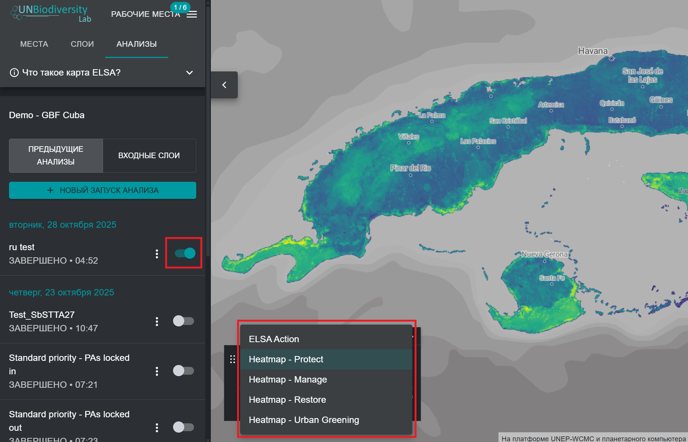
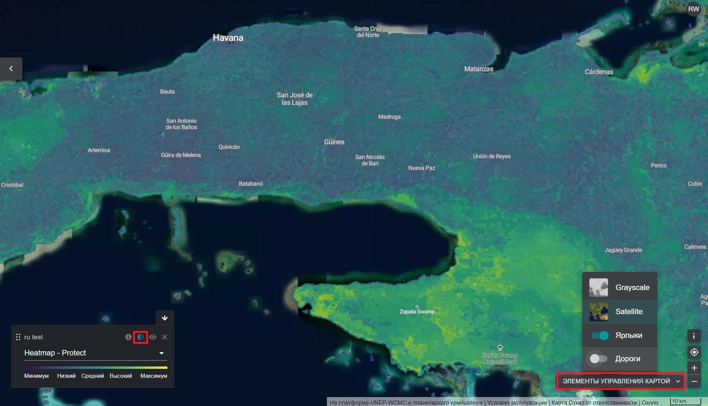

# Просмотр тепловых карт

После выполнения анализа ELSA вы сможете просмотреть результаты, нажав на три вертикальные точки рядом с записью анализа на левой вкладке и нажав кнопку «Просмотр». В раскрывающемся меню легенды, которая появляется на карте, вы можете выбрать между просмотром окончательной карты действий или слоев тепловой карты. Мы рекомендуем сначала просмотреть тепловые карты. 

<figure markdown>

<figcaption>Рисунок 15. Просмотр тепловой карты</figcaption>
</figure>

Тепловые карты определяют важные места для достижения целей ГПБ 1-12 или других политических целей, установленных вашей страной. Они представляют собой нормализованную сумму значений планировочных элементов в каждой единице планирования с учетом веса, присвоенного каждому планировочному элементу. Важные области (где находится больше планировочных элементов) отображаются в диапазоне цветов от зеленого до желтого, причем области ярко-желтого цвета являются наиболее важными. Тепловые карты можно использовать для определения областей, в которых общий вклад планировочных элементов в достижение целей ГПБ 1-12 является наибольшим. 

Оценивая тепловые карты, эксперты по данным могут просматривать агрегированные данные о планировочных элементах, взвешенные по пользователям, чтобы определить, соответствуют ли модели их ожиданиям и личным знаниям о регионе. Чтобы облегчить этот процесс, пользователи могут переключаться между тепловыми картами и базовыми спутниковыми изображениями/дорожными картами/картами планировочных элементов, что помогает ориентироваться на тепловых картах ландшафта и определять, какие планировочные элементы вносят особый вклад в области, имеющие большое значение для целей ГПБ. 

!!! important
    Чтобы переключаться между спутниковыми снимками и дорогами, пользователи должны нажать кнопку «ЭЛЕМЕНТЫ УПРАВЛЕНИЯ КАРТОЙ» в правом нижнем углу приложения UNBL. Затем пользователи могут нажать на значок глаза в поле легенды, чтобы скрыть тепловую карту и просмотреть спутниковые снимки, или на кнопку прозрачности слева от значка глаза, чтобы увеличить прозрачность тепловой карты и одновременно увидеть спутниковые снимки а так же тепловую карту. 

<figure markdown>
{#fig-eval-hm}
<figcaption>Рисунок 16. Оценка тепловых карт</figcaption>
</figure>
