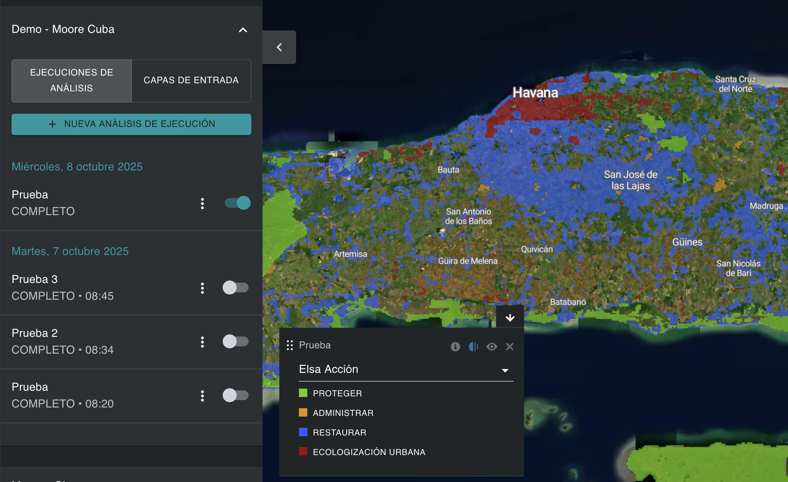
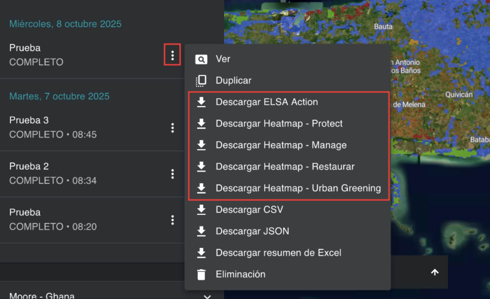

# Visualización y descarga de mapas de acción  

Después de ejecutar un análisis ELSA, puedes visualizar el mapa final de acciones asociado a esa versión del análisis activando la ejecución del análisis en la pestaña izquierda. La capa resultante denominada ‘Acción ELSA’, que aparece por defecto en el mapa, es el mapa final de acciones y muestra las áreas prioritarias para acciones de protección, restauración, manejo y/o reverdecimiento urbano en su país, que pueden contribuir de la mejor manera a los resultados de las Metas 1 a 12 del KMGBF, así como apoyar la implementación de la jerarquía de respuesta de Neutralidad de la Degradación de la Tierra (LDN, por sus siglas en inglés) bajo la Convención de las Naciones Unidas de Lucha contra la Desertificación (UNCCD). La jerarquía de respuesta LDN es un enfoque estructurado para alcanzar la neutralidad mediante la priorización de la prevención, la minimización de la degradación en curso y la restauración de tierras degradadas.

De manera similar a los mapas de calor, los usuarios pueden acercarse a áreas específicas utilizando la interfaz de UNBL y activar imágenes satelitales, así como otras capas disponibles en el espacio de trabajo o en la plataforma pública de UNBL, para evaluar los resultados finales. 

<figure markdown>

<figcaption>Figura 17. Mapa de acción que muestra las áreas prioritarias para la protección, restauración, y otros alrededor de Havana</figcaption>
</figure>

Los usuarios también pueden descargar los mapas de acción y los mapas de calor resultantes en formato ráster para su uso externo en software SIG de escritorio.   

<figure markdown>

<figcaption>Figura 18. Descargar los mapas de análisis resultantes</figcaption>
</figure>
