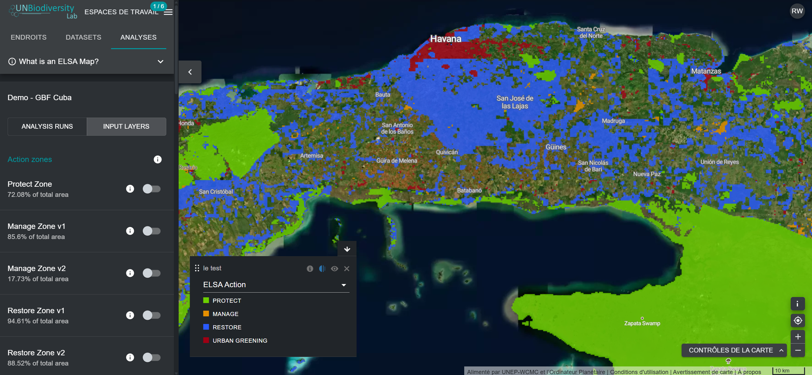
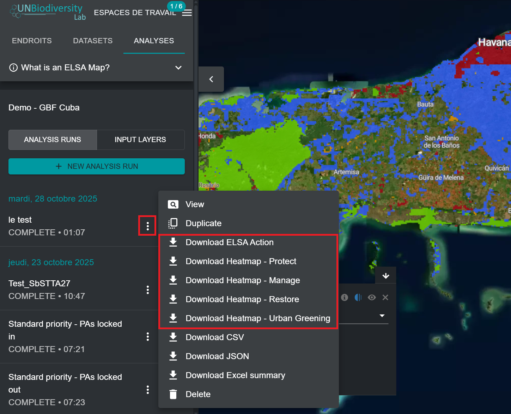

# Affichage et téléchargement des cartes d'action

Après avoir effectué une analyse ELSA, vous pouvez afficher la carte d'action finale associée à cette version de l'analyse en basculant l'analyse dans l'onglet de gauche. La couche « ELSA Action » qui s'affiche par défaut sur la carte est la carte d'action finale qui indique les zones prioritaires pour les actions de protection, de restauration, de gestion, et/ou de verdissement urbain dans votre pays qui peuvent le mieux contribuer aux résultats des objectifs 1 à 12 du KMGBF. Comme pour les heatmaps, les utilisateurs peuvent zoomer sur des zones spécifiques à l'aide de l'interface UNBL et basculer entre les images satellite et les autres couches disponibles dans l'espace de travail/la plateforme publique UNBL afin d'évaluer les résultats finaux.

<figure markdown>

<figcaption>Figure 17. Carte d'action ELSA indiquant les zones prioritaires pour la protection et la restauration autour de La Havane</figcaption>
</figure>

Les utilisateurs peuvent également télécharger les cartes d'action et les heatmaps obtenues au format raster pour les utiliser dans un logiciel SIG externe.

<figure markdown>

<figcaption>Figure 18. Téléchargement des cartes d'analyse obtenues</figcaption>
</figure>