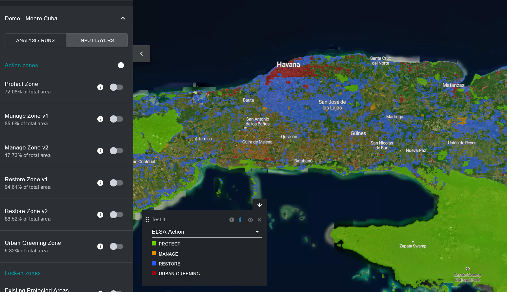
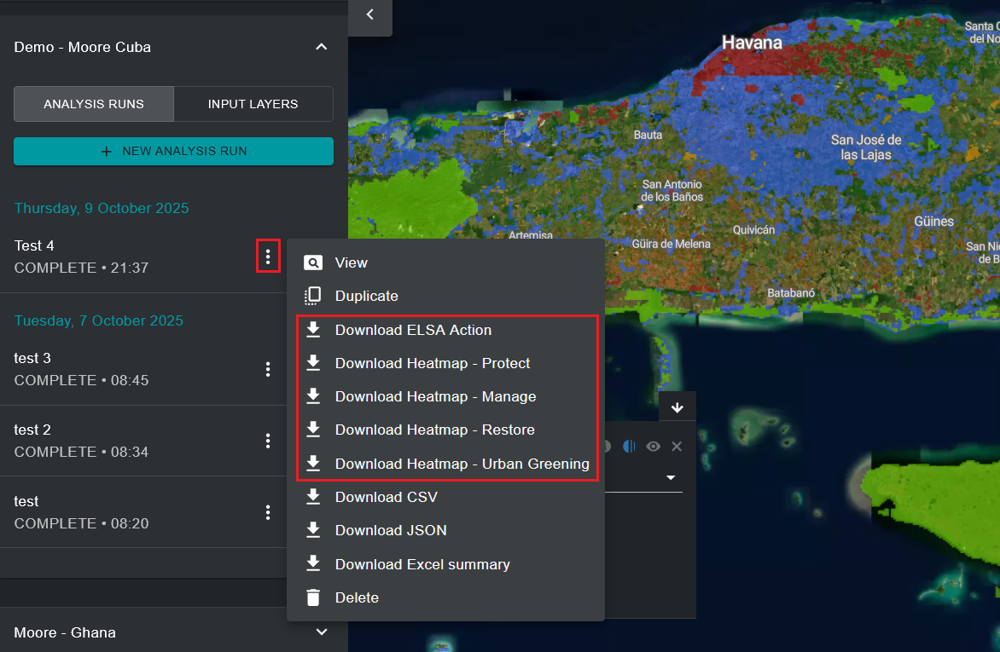

# Viewing and downloading ELSA Action maps

After running an ELSA analysis, you can view the final action map associated with that version of the analysis by toggling the analysis run in the left tab. The resulting ‘ELSA Action’ layer that shows up on the map by default is the final action map which shows priority areas for protection, restoration, management and/or urban greening actions in your country that can best contribute to outcomes for KMGBF Targets 1-12, as well as support the implementation of the Land Degradation Neutrality (LDN) response hierarchy under the UN Convention to Combat Desertification (UNCCD). The LDN response hierarchy is a structured approach to achieve neutrality by prioritizing prevention, minimizing ongoing degradation, and restoring degraded land. 

Similar to the heatmaps, users can zoom in to specific areas using the UNBL interface and toggle satellite imagery as well as other layers available in the workspace/UNBL public platform to evaluate the final results. 

<figure markdown>

<figcaption>Figure 17. Action map showing priority areas for protection and restoration around Havana</figcaption>
</figure>

Users can also download resulting action maps and heatmaps in raster format for external use in desktop GIS software. 

<figure markdown>

<figcaption>Figure 18. Download resulting analysis maps</figcaption>
</figure>