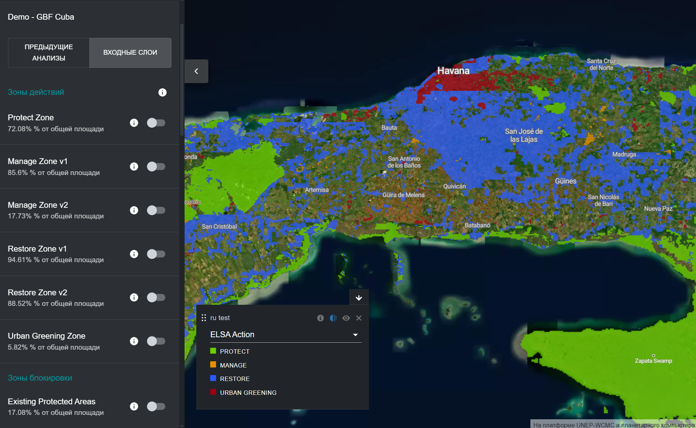
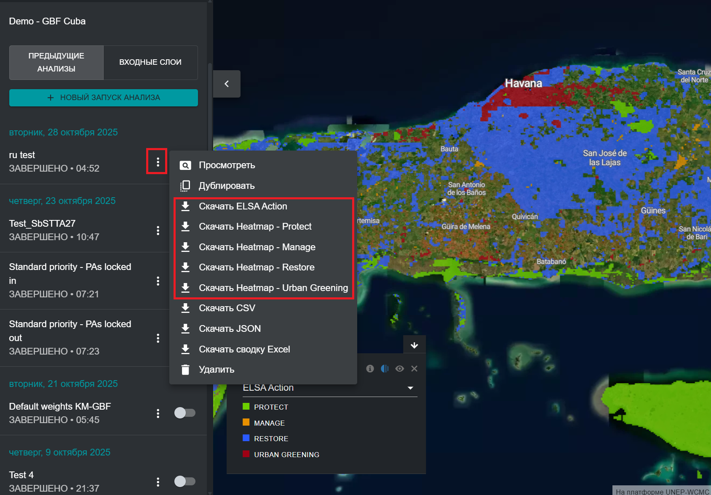

# Просмотр и загрузка окончательной карты приоритетных областей

После запуска пространственного анализа приоритетов пользователи могут просматривать окончательную карту приоритетных областей/территорий, связанную с этой версией анализа, переключая запуск анализа на левой вкладке. Полученный слой приоритетных территорий, который по умолчанию отображается на карте, представляет собой окончательную карту действий, на которой показаны приоритетные территории для защиты, восстановления, управления и/или озеленения городов в вашей стране, которые могут наилучшим образом способствовать достижению целей ГПБ 1-12, а также поддерживать реализацию иерархии мер по достижению нейтрального уровня деградации земель (LDN) в рамках Конвенции ООН по борьбе с опустыниванием (UNCCD). Иерархия мер по достижению LDN представляет собой структурированный подход к достижению нейтрального уровня путем уделения приоритетного внимания предотвращению, уменьшения продолжающейся деградации и оборота вспять в натуральное состояние деградированных земель. 

Аналогично тепловым картам, пользователи могут увеличить масштаб конкретных областей с помощью интерфейса UNBL и переключать спутниковые изображения, а также другие слои, доступные в рабочей области/публичной платформе UNBL, для оценки окончательных результатов. 

<figure markdown>

<figcaption>Рисунок 17. Карта приоритетных оюластей для защиты, восстановления, управления и озеленения городов вокруг Гаваны</figcaption>
</figure>

Пользователи также могут загрузить полученные карты приоритетных территорий и тепловые карты в растровом формате для внешнего использования в личных ГИС-проектах и программном обеспечении. 

<figure markdown>

<figcaption>Рисунок 18. Загрузка полученных карт анализа</figcaption>
</figure>
