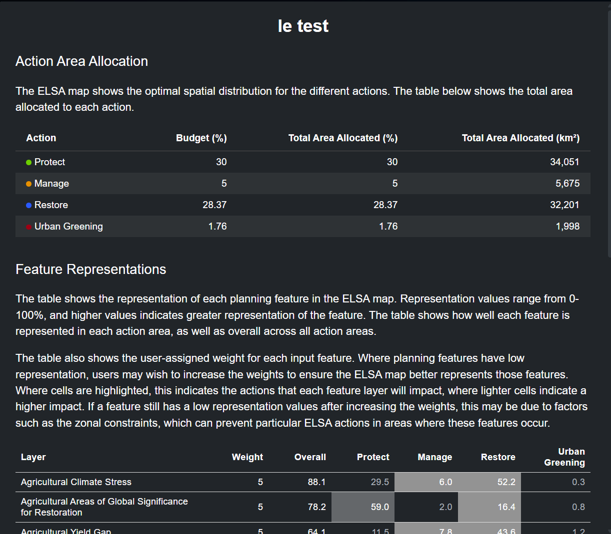
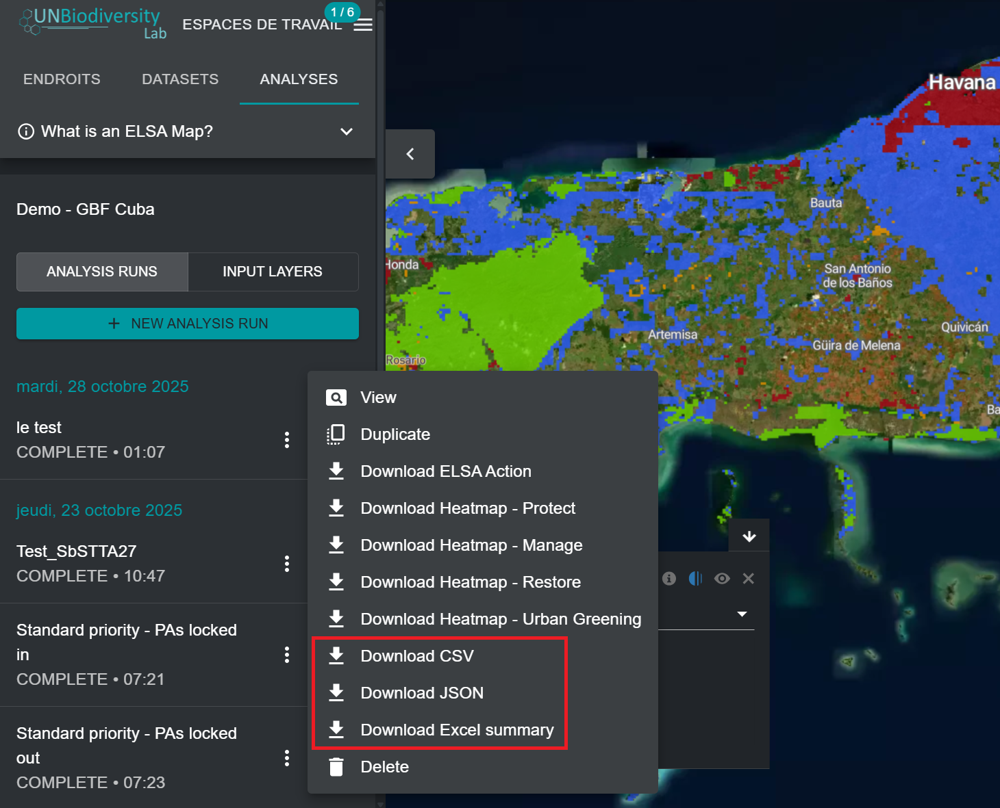

# Analyse des synergies et des compromis

L'analyse ELSA permet notamment d'identifier les synergies entre les actions visant les objectifs KMGBF qui couvrent la biodiversité, le changement climatique et le bien-être humain. L'analyse mesure le résultat de chaque élément de planification à l'aide d'un score de représentation afin de montrer où la planification simultanée de tous les objectifs KMGBF aurait pu conduire à une représentation moins importante de certains éléments de planification par rapport à d'autres.

Après avoir effectué une analyse, vous pouvez consulter les résultats et évaluer si les paramètres sélectionnés ont conduit à une représentation acceptable pour chacune des caractéristiques de planification.

Vous pouvez examiner la représentation des caractéristiques de planification en cliquant sur l'icône « **i** » dans la légende de la couche de l'analyse exécutée. Cela affichera une fenêtre d'informations de test avec la superficie totale allouée à chaque action basée sur la nature dans l'analyse, ainsi qu'un tableau indiquant le poids, la représentation globale, et la représentation individuelle de chaque action fondée sur la nature pour chaque caractéristique de planification.

<figure markdown>

<figcaption>Figure 19. Boîte d'informations sur les représentations des caractéristiques</figcaption>
</figure>

Vous pouvez également enregistrer ces mêmes informations sur votre ordinateur local en cliquant sur le bouton à trois points verticaux à côté de l'entrée de votre analyse, puis en cliquant sur « Télécharger CSV » ou « Télécharger JSON », selon le format souhaité. Vous pouvez également cliquer sur « Télécharger le résumé Excel » pour télécharger une fiche d'information plus complète qui présente les descriptions des données et les métadonnées pour chaque élément de planification, les descriptions des objectifs politiques utilisés pour l'analyse, et les ressources d'analyse ELSA ainsi que les scores de représentation.

<figure markdown>

<figcaption>Figure 20. Télécharger le tableau récapitulatif de la représentation des caractéristiques</figcaption>
</figure>

Vous pouvez évaluer les scores de représentation des caractéristiques de planification de votre choix, puis dupliquer et exécuter de manière itérative des analyses supplémentaires en augmentant ou en diminuant les pondérations des caractéristiques de planification, selon que vous souhaitez augmenter ou diminuer leur représentation dans la carte ELSA finale.