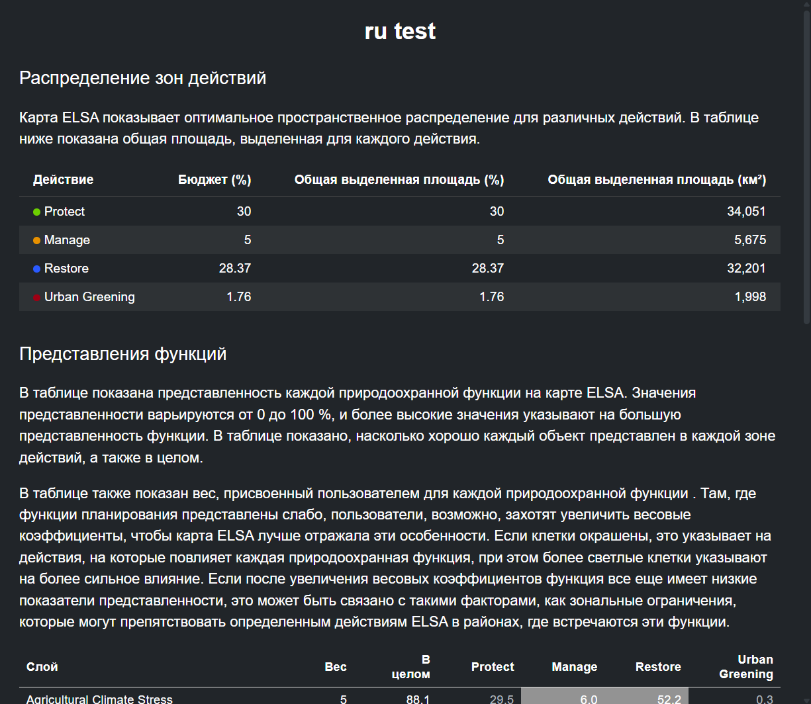
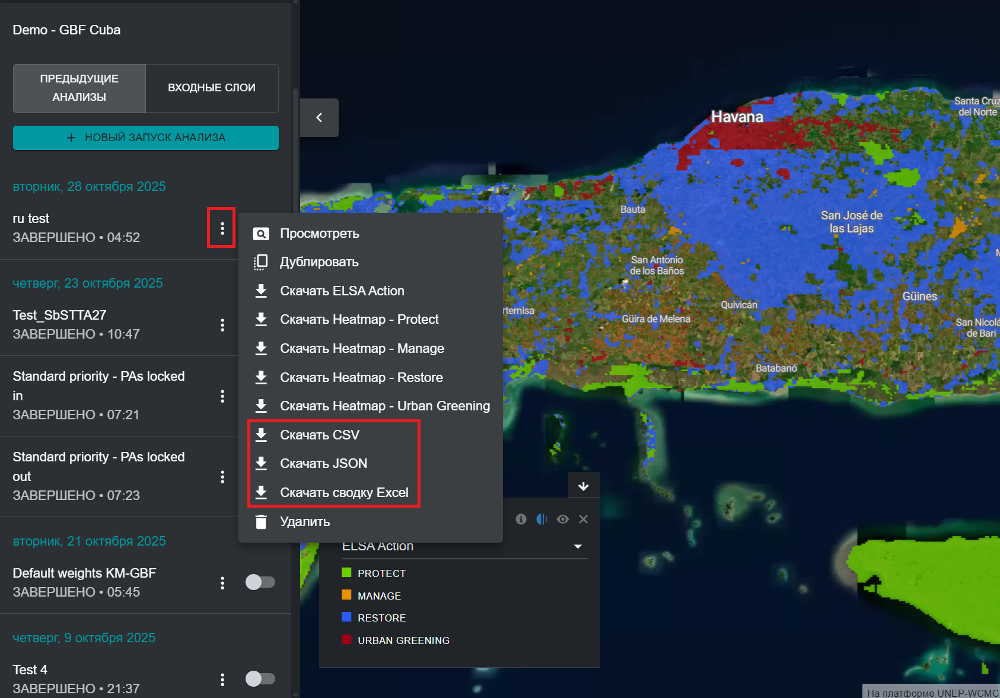

# Анализ синергии и компромиссов

Одним из результатов анализа ELSA является выявление синергии между действиями в области биоразнообразия, изменения климата и устойчивого развития. Анализ измеряет результат каждого планировочного элемента с помощью показателя «представления», чтобы показать, где планирование по трем темам (биоразнообразие, изменение климата и экосистемные услуги) создает компромиссы. Где, на тематических картах:

$$
\text{Показатель представления} = \frac{\text{Представление на карте приоритетных областей}}{\text{Максимальное представление на тематических картах}}
$$

После проведения анализа пользователи могут просмотреть результаты и оценить, привели ли выбранные параметры к приемлемому представлению для каждого из элементов планирования. 

Пользователи могут просмотреть представления элементов, нажав на значок **«i»** в легенде слоя переключенного анализа. При этом отобразится окно с тестовой информацией, содержащее общую площадь земель, выделенных для каждого природоохранного мероприятия в анализе, а также таблица с весом, общим представлением и индивидуальным представлением для каждого природоохранного мероприятия по каждому элементу планирования.

<figure markdown>

<figcaption>Рисунок 19. Информационное окно представления элементов</figcaption>
</figure>

Пользователи могут также сохранить эту же информацию на своих локальных компьютерах, нажав на кнопку с тремя вертикальными точками рядом с записью своего анализа, а затем нажав «Скачать CSV» или «Скачать JSON», в зависимости от желаемого формата. Пользователи также могут нажать «Скачать сводку в формате Excel», чтобы загрузить более полный информационный лист с результатами теста, в котором представлены описания данных и метаданные для каждого планировочного элемента, описания целей политики, использованных для анализа, и ресурсы пространственного анализа приоритетов наряду с оценками представления.  

<figure markdown>

<figcaption>Рисунок 20. Скачать сводную таблицу представления функций</figcaption>
</figure>

Пользователи могут оценить оценки представления для выбранных ими планировочных элементов и повторно дублировать и запускать дополнительные анализы с увеличенными/уменьшенными весами для планировочных элементов в зависимости от того, хотят ли они увеличить/уменьшить их представление на окончательной карте приоритетных территорий.
