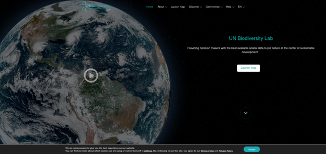

# UNBL Documentation

Welcome to the UN Biodiversity Lab (UNBL) documentation. This guide will help you navigate and use the platform effectively.

  

!!! attention
    We try to keep this documentation continuously updated. For the latest features and updates, visit the [UNBL platform](https://unbiodiversitylab.org).

## Getting Started

New to UNBL? Start here to learn the basics:

-   :rocket: **Quick Start**

    ---

    Learn how to register and access the UNBL platform

    [:octicons-arrow-right-24: Get Started](unbl/1_register.md)

-   :world_map: **Navigation**

    ---

    Navigate between the website and data application

    [:octicons-arrow-right-24: Learn More](unbl/3_navigate.md)

-   :earth_africa: **Find Your Area**

    ---

    Search and explore data for your country or region

    [:octicons-arrow-right-24: Explore](unbl/7_find_country.md)

-   :bar_chart: **View Data**

    ---

    Discover dynamic metrics and indicators

    [:octicons-arrow-right-24: View Data](unbl/8_dynamic_metrics1.md)

## Account Management

-   :material-account: **Manage Account**

    ---

    Edit your profile and account settings

    [:octicons-arrow-right-24: Manage](unbl/2_manage.md)

-   :material-web: **Language Settings**

    ---

    Change interface language

    [:octicons-arrow-right-24: Settings](unbl/4_language.md)

## Working with Data

-   :material-magnify: **Find Data Layers**

    ---

    Search and discover available datasets

    [:octicons-arrow-right-24: Search](unbl/10_find_layers.md)

-   :material-chart-line: **Layer Information**

    ---

    Learn about data sources and metadata

    [:octicons-arrow-right-24: Learn More](unbl/12_find_layer_info.md)

-   :material-clock-outline: **Time Series**

    ---

    Visualize changes over time

    [:octicons-arrow-right-24: Visualize](unbl/14_time_series_data.md)

-   :material-palette: **Customize Views**

    ---

    Adjust layer opacity and ordering

    [:octicons-arrow-right-24: Customize](unbl/13_customize_mapview.md)

-   :material-share-variant: **Share & Export**

    ---

    Share maps and download data

    [:octicons-arrow-right-24: Share](unbl/15_share_data.md)

-   :material-map: **Create Maps**

    ---

    Make publication-ready maps

    [:octicons-arrow-right-24: Create](unbl/18_maps_for_reports.md)

## Map Navigation

-   :material-compass: **Map Controls**

    ---

    Zoom, pan, and navigate the map interface

    [:octicons-arrow-right-24: Navigate](unbl/5_adjust_mapview.md)

-   :material-map-outline: **Base Maps**

    ---

    Customize labels, roads, and satellite views

    [:octicons-arrow-right-24: Customize](unbl/6_manage_labels_and_basemaps.md)

## Advanced Features

-   :material-earth: **Digital Public Goods**

    ---

    Access open data layers

    [:octicons-arrow-right-24: Access](unbl/11_find_dpg_layers.md)

-   :material-content-cut: **Clip & Export**

    ---

    Download data clipped to your area

    [:octicons-arrow-right-24: Download](unbl/16_clip_export.md)

-   :material-link-variant: **Global Data Access**

    ---

    Access full global datasets

    [:octicons-arrow-right-24: Access](unbl/17_download_global_data.md)

-   :material-office-building: **UNBL Workspaces**

    ---

    Request secure collaborative spaces

    [:octicons-arrow-right-24: Request](unbl/20_private_workspaces.md)

## Community & Support

-   :material-lightbulb: **Suggest Data**

    ---

    Recommend new datasets for inclusion

    [:octicons-arrow-right-24: Suggest](unbl/19_suggest_data.md)

-   :material-tools: **Troubleshooting**

    ---

    Common issues and solutions

    [:octicons-arrow-right-24: Troubleshoot](unbl/troubleshooting.md)

-   :material-book-open: **Tutorials**

    ---

    Step-by-step guides

    [:octicons-arrow-right-24: Learn](unbl/tutorials.md)

-   :material-forum: **Get Help**

    ---

    Contact support and community

    [:octicons-arrow-right-24: Contact](#support)

## About the Platform

The UN Biodiversity Lab (UNBL) is a collaborative initiative that brings together the best available spatial data on nature, climate change, and sustainable development. Our platform democratizes access to critical environmental data and analytics tools.

**Key Features:**

- :earth_africa: **400+ Global Datasets** - Curated collection of authoritative spatial data
- :bar_chart: **Dynamic Indicators** - Real-time metrics for any country worldwide
- :wrench: **No GIS Experience Required** - User-friendly interface for all skill levels
- :globe_with_meridians: **Multilingual Support** - Available in English, Spanish, French, Portuguese, and Russian
- :lock: **Secure Workspaces** - Private collaborative environments for institutions
- :book: **Open Source** - Transparent, community-driven development

**Partnership:**

UNBL is a partnership between UNDP, UNEP, UNEP-WCMC, and the CBD Secretariat, working with technical partners and data providers to support evidence-based decision-making for nature and sustainable development.

## Support & Contact {#support}

!!! info ""
    For technical support, data questions, or workspace requests, contact <support@unbiodiversitylab.org>

**Additional Resources:**

- :globe_with_meridians: **UNBL Platform**: [unbiodiversitylab.org](https://unbiodiversitylab.org)
- :email: **Email Support**: support@unbiodiversitylab.org
- :clipboard: **Data Request Form**: [Suggest new datasets](https://forms.gle/AFqQf5dPZySQnhdq9)
- :office: **Workspace Request**: [Contact us](https://www.unbiodiversitylab.org/support/)

---

## Complete Documentation

The navigation structure is defined in `mkdocs.yml`. The documentation is organized into the following sections:

- **Getting Started**: Registration, account management, navigation, and language settings
- **Map Navigation**: Map controls, basemaps, and finding locations
- **Working with Data**: Metrics, layers, time series, and customization
- **Sharing & Export**: Data sharing, clipping, downloads, and map creation
- **Advanced Features**: Digital public goods, workspaces, and data suggestions
- **Reference**: Data catalog, troubleshooting, tutorials, and contributing guidelines