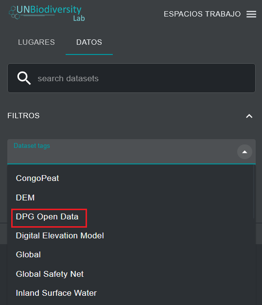
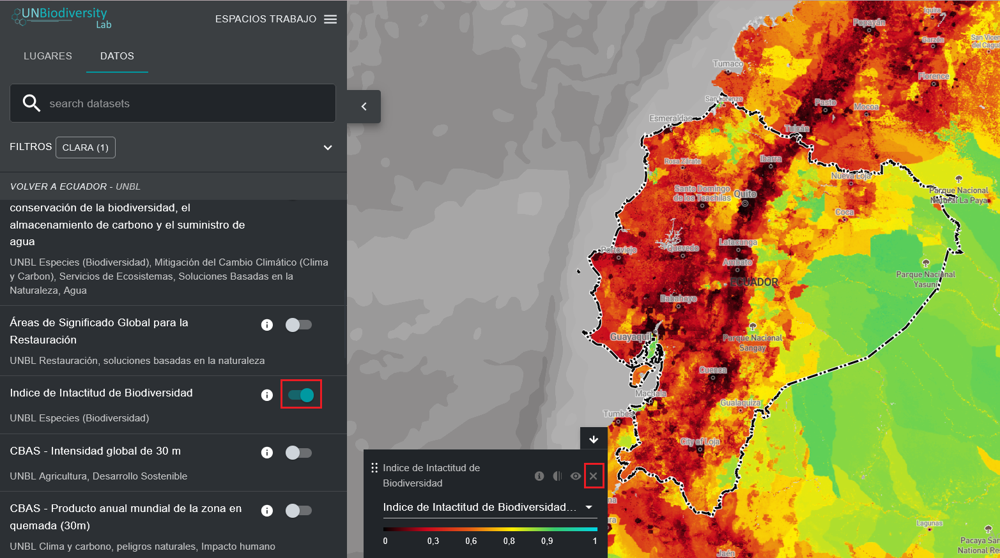

# ¿Cómo puedo encontrar los conjuntos de datos abiertos de Digital Public Good (DPG)?

El UN Biodiversity Lab está certificado como plataforma de bienes públicos digitales (DPG) por la Alianza de Bienes Públicos Digitales. Ofrece a los responsables políticos nuevas formas de interactuar con datos espaciales de alta calidad. Puede ver los conjuntos de datos espaciales reconocidos como datos abiertos DPG a escala mundial o dentro de un área de interés.

1. Haga clic en el icono «CONJUNTOS DE DATOS».

2. Haga clic para expandir los filtros.

3. En los filtros, haga clic para ampliar las etiquetas del conjunto de datos. A continuación, seleccione «Datos abiertos DPG».

	
	
4. Contraiga la lista «FILTROS» y vea la lista de datos abiertos DPG en UNBL.

5. Haga clic en el botón de activación situado a la derecha del nombre del conjunto de datos para cargar el conjunto de datos de interés en el mapa.

6. Haga clic de nuevo en el botón de activación o haga clic en el icono X de la leyenda para eliminar este conjunto de datos.

	