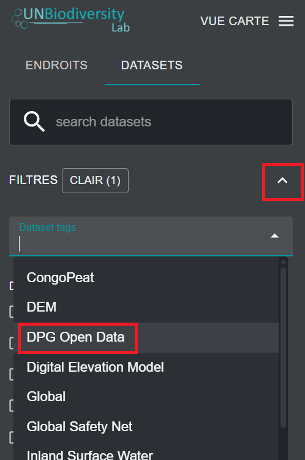
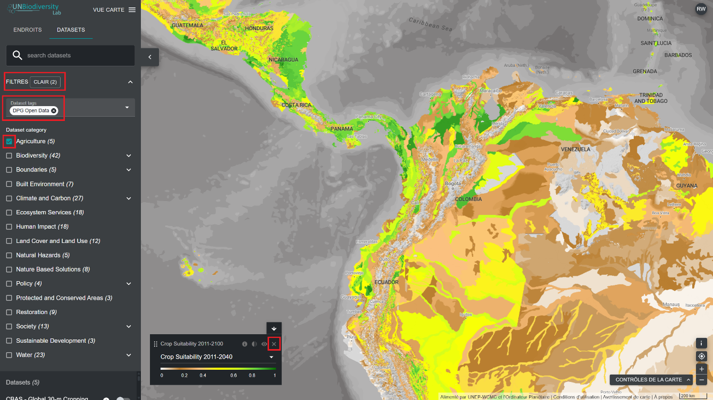

# Comment trouver les ensembles de données ouvertes Digital Public Good (DPG) ?

Le UN Biodiversity Lab est certifié comme plateforme Digital Public Good (DPG) par la Digital Public Goods Alliance. Il offre aux décideurs politiques de nouveaux moyens d'interagir avec des données spatiales de haute qualité. Vous pouvez consulter les ensembles de données spatiales reconnus comme données ouvertes DPG à l'échelle mondiale ou dans une zone qui vous intéresse.

1. Cliquez sur l'icône DATASETS.

2. Cliquez pour développer les filtres.

3. Dans les filtres, cliquez pour développer les balises des ensembles de données. Sélectionnez ensuite « Données ouvertes DPG ».

	

4. Réduisez la liste FILTRES et affichez la liste des données ouvertes DPG sur UNBL.

5. Cliquez sur le bouton à bascule à droite du nom de l'ensemble de données pour charger l'ensemble de données qui vous intéresse sur la carte.

6. Cliquez à nouveau sur le bouton bascule, ou cliquez sur l'icône X dans la légende pour supprimer cet ensemble de données.

	