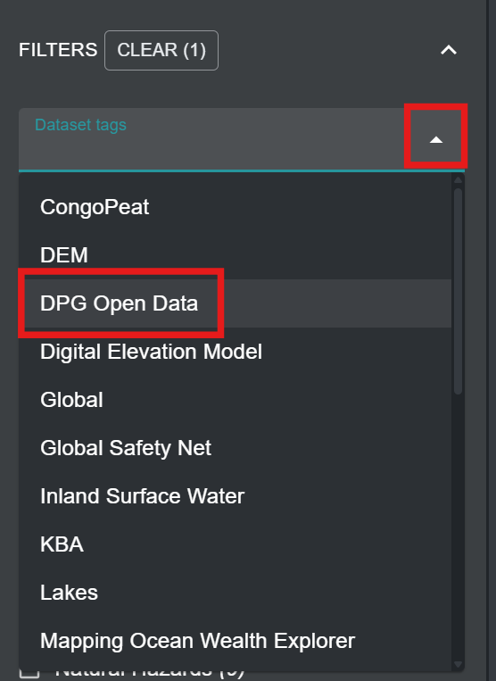
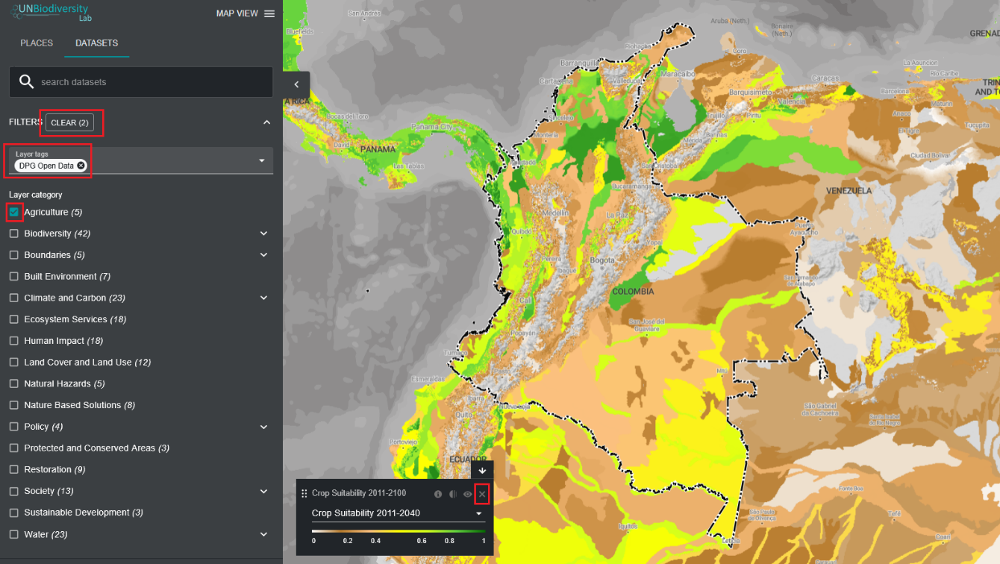

# How do I find the Digital Public Good (DPG) open data layers?

The UN Biodiversity Lab is certified as a Digital Public Good (DPG) platform by the Digital Public Goods Alliance. It provides novel ways for policymakers to interact with high-quality spatial data. You can view the spatial datasets recognized as DPG open data on a global scale or within an area of interest. 

  
▶️ Prefer video? Click here!

  

    <iframe
      src="https://www.youtube-nocookie.com/embed/NcXPT92Yrrg"
      title="UNBL tutorial"
      frameborder="0"
      allow="accelerometer; clipboard-write; encrypted-media; gyroscope; picture-in-picture; web-share"
      allowfullscreen>
    </iframe>
  

1.	Click on the 'DATASETS' tab icon.

2.	Click to expand the filters.

3.	In filters, click to expand the dataset tags. Then, select “DPG Open Data”.

	
	
4.	Collapse the 'FILTERS' list and view the list of DPG Open Data on UNBL.

5.	Click the toggle button to the right of the dataset name to load dataset of interest to the map. 

6.	Click the toggle button again or click the **X** icon in the dataset legend to remove this dataset.

	

