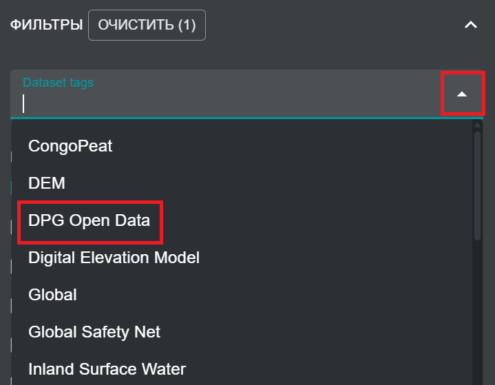
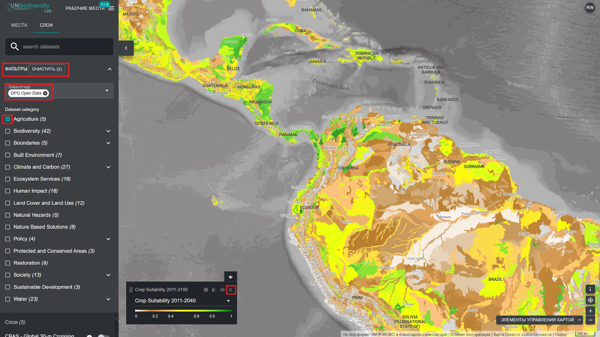

# Как мне найти открытые наборы данных Digital Public Good (DPG)?

Лаборатория ООН по биоразнообразию сертифицирована Аллайансом *Digital Public Goods Alliance* как платформа *Digital Public Good (DPG)*. Она предоставляет политикам новые способы взаимодействия с высококачественными пространственными данными. Вы можете просматривать пространственные наборы данных, признанные открытыми данными DPG, в глобальном масштабе или в пределах интересующей вас области. 

  
▶️ Предпочитаете видео? Нажмите сюда!

  

    <iframe
      src="https://www.youtube-nocookie.com/embed/3JirK4Puv10"
      title="UNBL tutorial"
      frameborder="0"
      allow="accelerometer; clipboard-write; encrypted-media; gyroscope; picture-in-picture; web-share"
      allowfullscreen>
    </iframe>
  

1.	Нажмите на значок «НАБОРЫ ДАННЫХ» (или «СЛОИ»).

2.	Нажмите, чтобы развернуть фильтры.

3.	В фильтрах нажмите, чтобы развернуть теги наборов данных. Затем выберите «Открытые данные DPG» (DPG Open Data).

	

4.	Сверните список ФИЛЬТРЫ и просмотрите список открытых данных DPG на UNBL.

5.	Нажмите переключатель справа от названия набора данных, чтобы загрузить интересующий вас набор данных на карту. 

6.	Нажмите переключатель еще раз или нажмите значок **Х** на легенде, чтобы удалить этот набор данных.

	

