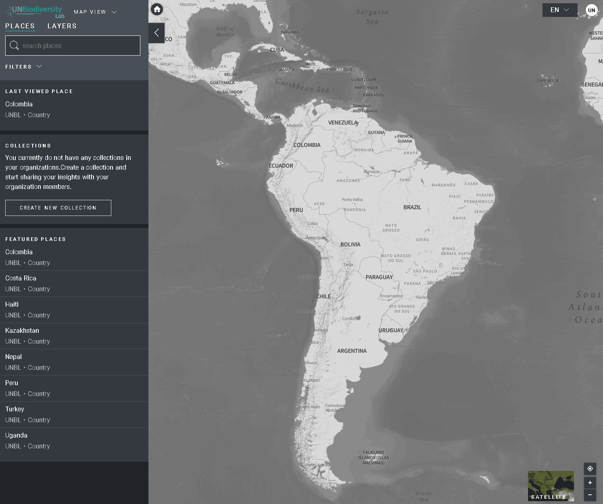

# How do I find additional data layers for my country?

Navigate to your area of interest, if preferred. You can also stay on the global view. 

1. Click on the *LAYERS* icon.
2. To search for a layer, you can either:
3. Type the name of the layer you want to view into the search box, and select the desired result in the layer list. 
4. Click to expand the layer tags, and select the data tag of interest. You then can select the desired layer from the layer list. **OR**
5. Click to expand the filters box, and select your filter of interest. You then can select the desired place from the search result list.
6. Click the toggle to the left of the layer name to load this layer to the map.  
7. Click the toggle again or click the *X* icon on the layer info to remove this layer.

**Note:** You can load multiple layers at the same time. You can also adjust the opacity of each layer by clicking on the layer name to open the layer info, and adjusting the opacity slider.