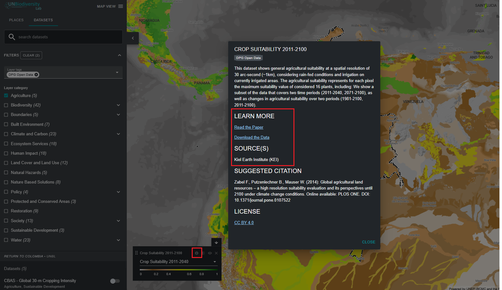

# ¿Cómo encuentro más información sobre cada conjunto de datos?

1.	Seleccione el conjunto de datos y cárguelo en el mapa.

2.	En la esquina inferior izquierda de la vista del mapa, habrá una leyenda que muestra el nombre y la simbología de todos los conjuntos de datos actualmente activados en el mapa. Haga clic en el icono {style="display: inline; width: 1em; height: 2em; width: 2em;"} para ver la información del conjunto de datos. Alternativamente, haga clic en el mismo icono {style="display: inline; width: 1em; height: 2em; width: 2em;"} directamente junto al botón de alternancia para cada conjunto de datos en la pestaña de búsqueda de conjuntos de datos. La información proporciona una descripción del conjunto de datos, organización fuente, citas y enlaces para descargar los datos.

