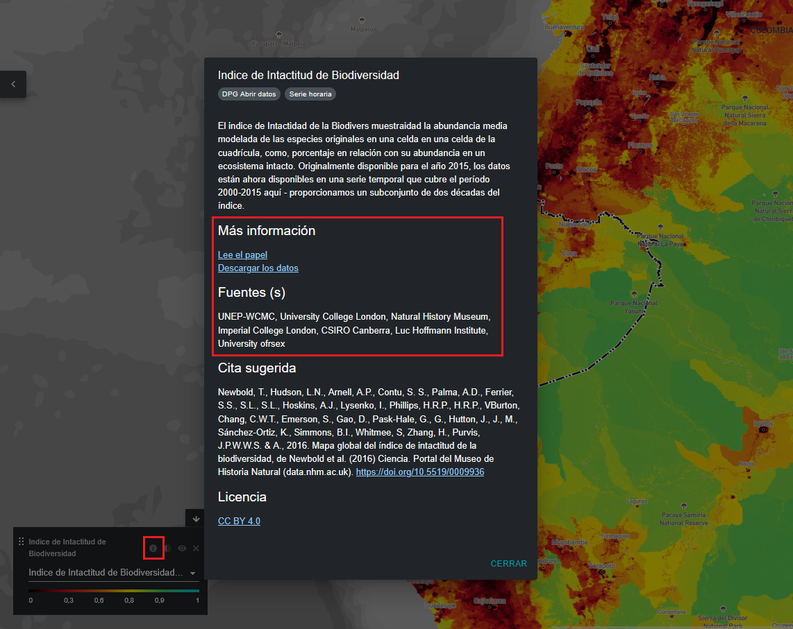

# ¿Cómo puedo encontrar más información sobre cada conjunto de datos?

  
▶️ ¿Prefieres el vídeo? ¡Haz clic aquí!

  

    <iframe
      src="https://www.youtube-nocookie.com/embed/ifkK50BYQPk"
      title="UNBL tutorial"
      frameborder="0"
      allow="accelerometer; clipboard-write; encrypted-media; gyroscope; picture-in-picture; web-share"
      allowfullscreen>
    </iframe>
  

1. Seleccione el conjunto de datos y cárguelo en el mapa.

2. En la esquina inferior izquierda de la vista del mapa, habrá una leyenda que muestra el nombre y la simbología de todos los conjuntos de datos actualmente activados en el mapa. Haga clic en el {style="display: inline; width: 1em; height: 2em; width: 2em;"} icono para ver la información del conjunto de datos. También puede hacer clic en el mismo {style="display: inline; width: 1em; height: 2em; width: 2em;"} icono situado junto al botón de activación de cada conjunto de datos en la pestaña de búsqueda de conjuntos de datos. La información proporciona una descripción del conjunto de datos, la organización de origen, citas y enlaces para descargar los datos.

