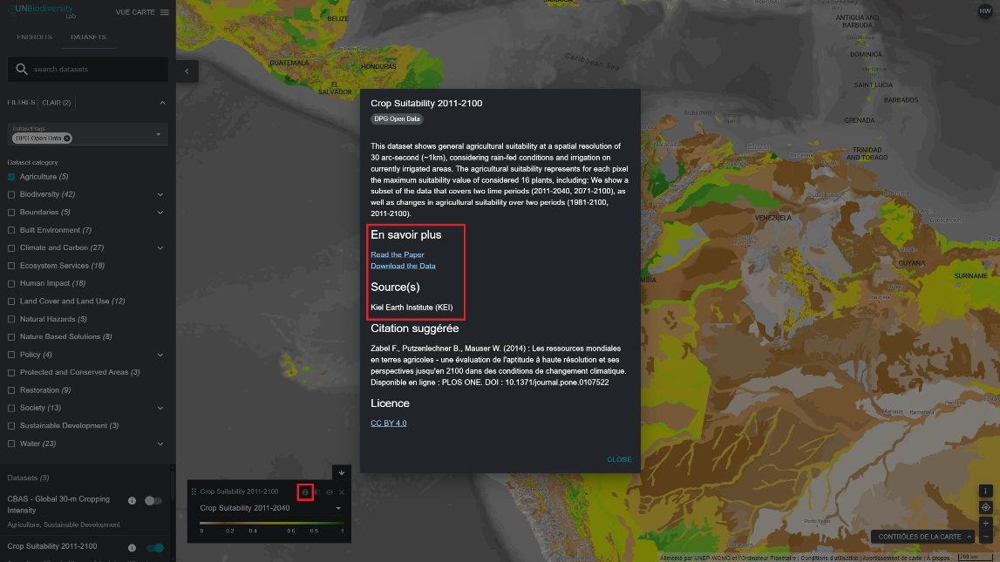

# Comment trouver plus d'informations sur chaque ensemble de données ?

  
▶️ Vous préférez la vidéo ? Cliquez ici !

  

    <iframe
      src="https://www.youtube-nocookie.com/embed/BhvahzmK47g"
      title="UNBL tutorial"
      frameborder="0"
      allow="accelerometer; clipboard-write; encrypted-media; gyroscope; picture-in-picture; web-share"
      allowfullscreen>
    </iframe>
  

1. Sélectionnez l'ensemble de données et chargez-le sur la carte.

2. Dans le coin inférieur gauche de la carte, une légende indique le nom et la symbologie de tous les ensembles de données actuellement activés sur la carte. Cliquez sur l'icône {style="display: inline; width: 1em; height: 2em; width: 2em;"} pour afficher les informations relatives à l'ensemble de données. Vous pouvez également cliquer sur la même icône {style="display: inline; width: 1em; height: 2em; width: 2em;"} située juste à côté du bouton d'activation de chaque ensemble de données dans l'onglet de recherche d'ensembles de données. Les informations fournies comprennent une description de l'ensemble de données, l'organisation source, des citations et des liens pour télécharger les données.

