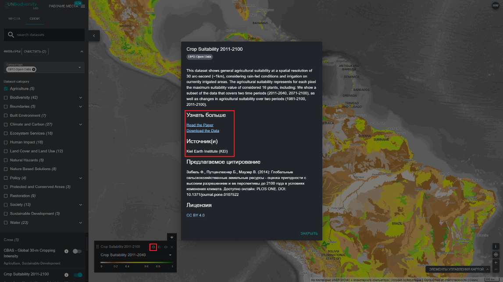

# Как мне найти дополнительную информацию о каждом наборе данных?

1.	Выберите набор данных и загрузите его на карту.

2.	В левом нижнем углу окна просмотра карты будет отображаться легенда с названиями и символами всех наборов данных, которые в данный момент включены на карте.  Нажмите на значок {style="display: inline; width: 1em; height: 2em; width: 2em;"} чтобы просмотреть информацию о наборе данных. Также можно нажать на тот же значок {style="display: inline; width: 1em; height: 2em; width: 2em;"} рядом с переключателем для каждого набора данных на вкладке поиска наборов данных. Информация содержит описание набора данных, организацию, источник, ссылки на научный отчет и ссылки для скачивания данных. 

