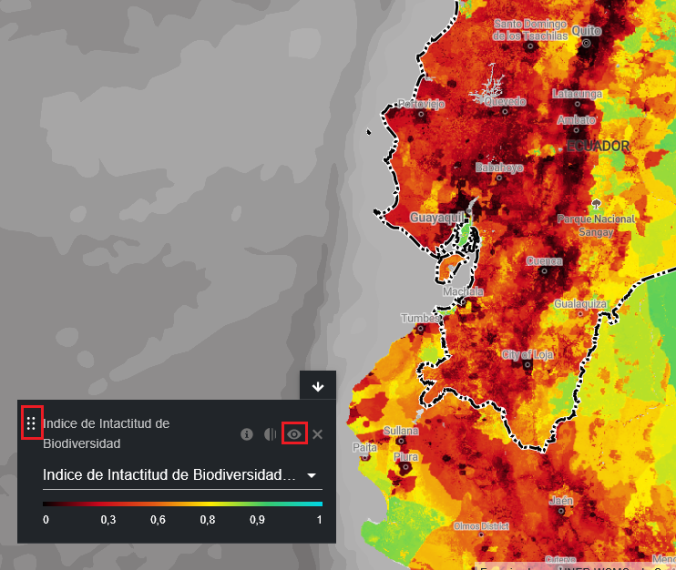

# ¿Cómo puedo personalizar la visualización de los conjuntos de datos?

Al seleccionar varios conjuntos de datos, puede personalizar el mapa ajustando su orden de superposición y opacidad.

  
▶️ ¿Prefieres el vídeo? ¡Haz clic aquí!

  

    <iframe
      src="https://www.youtube-nocookie.com/embed/4ZoGlPEWIOU"
      title="UNBL tutorial"
      frameborder="0"
      allow="accelerometer; clipboard-write; encrypted-media; gyroscope; picture-in-picture; web-share"
      allowfullscreen>
    </iframe>
  

1. Para cambiar el orden de superposición, haga clic y mantenga pulsado el icono situado a la izquierda del nombre del conjunto de datos en la leyenda y mueva el conjunto de datos hacia arriba o hacia abajo según el orden de superposición que prefiera. El conjunto de datos superior de la leyenda será el conjunto de datos superior del mapa.

2. Para cambiar la opacidad, haga clic en el icono {style="display: inline; width: 1em; height: 2em; width: 2em;"}. Al reducir la opacidad, aumenta la transparencia del conjunto de datos. Por ejemplo, para visualizar tanto la pérdida de cobertura arbórea como las áreas protegidas, puede colocar el conjunto de datos de pérdida de cobertura arbórea por encima del conjunto de datos de áreas protegidas y ajustar la opacidad de las áreas protegidas al 60 %. Esto crea un mapa que muestra la pérdida de cobertura arbórea dentro de las áreas protegidas, así como la pérdida total en todo el país.

3. Para ocultar temporalmente un conjunto de datos en el mapa, haga clic en el {style="display: inline; width: 1em; height: 2em; width: 2em;"} icono. Para volver a hacerlo visible, haga clic en el {style="display: inline; width: 1em; height: 2em; width: 2em;"} icono.

