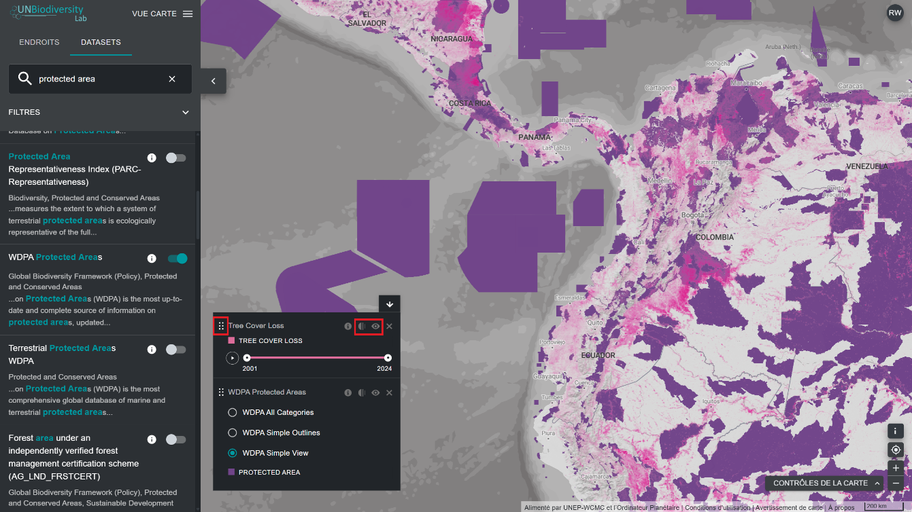

# Comment personnaliser l'affichage des ensembles de données ?

Lorsque vous sélectionnez plusieurs ensembles de données, vous pouvez personnaliser la carte en ajustant leur ordre de superposition et leur opacité.

  
▶️ Vous préférez la vidéo ? Cliquez ici !

  

    <iframe
      src="https://www.youtube-nocookie.com/embed/4ZoGlPEWIOU"
      title="UNBL tutorial"
      frameborder="0"
      allow="accelerometer; clipboard-write; encrypted-media; gyroscope; picture-in-picture; web-share"
      allowfullscreen>
    </iframe>
  

1. Pour modifier l'ordre des superpositions, cliquez et maintenez l'icône {style="display: inline; width: 1em; height: 2em; width: 2em;"} à gauche du nom de l'ensemble de données dans la légende, puis déplacez l'ensemble de données vers le haut ou vers le bas en fonction de l'ordre de superposition souhaité. L'ensemble de données situé en haut de la légende sera l'ensemble de données situé en haut de la carte.

2. Pour modifier l'opacité, cliquez sur l'icône {style="display: inline; width: 1em; height: 2em; width: 2em;"}. Réduisez l'opacité et augmentez la transparence de l'ensemble de données. Par exemple, pour visualiser à la fois la perte de couvert forestier et les aires protégées, vous pouvez positionner l'ensemble de données sur la perte de couvert forestier au-dessus de l'ensemble de données sur les aires protégées, et régler l'opacité des zones protégées à 60%. Vous obtenez ainsi une carte qui montre la perte de couvert forestier dans les zones protégées, ainsi que la perte globale dans tout le pays.

3. Pour masquer temporairement un ensemble de données sur la carte, cliquez sur l'icône {style="display: inline; width: 1em; height: 2em; width: 2em;"} (Masquer l'ensemble de données). Pour le rendre à nouveau visible, cliquez sur l'icône {style="display: inline; width: 1em; height: 2em; width: 2em;"} (Afficher l'ensemble de données).

