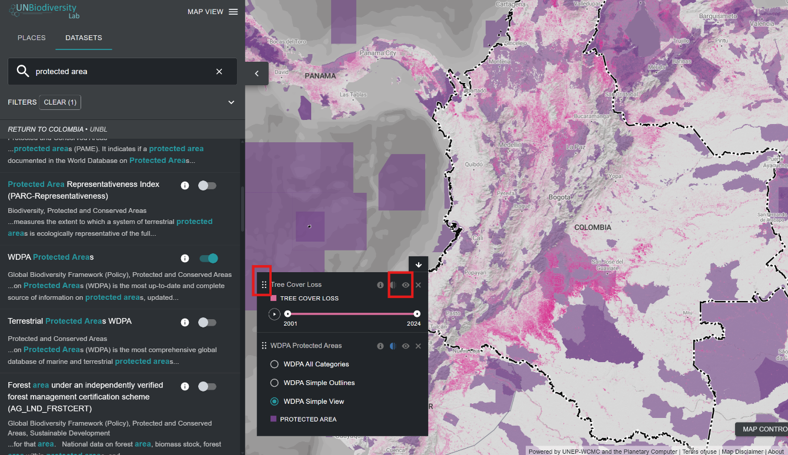

# How do I customize the dataset views?

When selecting multiple datasets, you can customize the map by adjusting their overlay order and opacity. 

1. To change the overlay order, click and hold the {style="display: inline; width: 1em; height: 2em; width: 2em;"} icon to the left of the dataset name in the legend and move the dataset up or down based on the preferred overlay order. The top dataset on the legend will be the top dataset on the map. 

2. To change the opacity, click on the {style="display: inline; width: 1em; height: 2em; width: 2em;"} icon. Reducing opacity increases the transparency of the dataset. For example, to visualize both tree cover loss and protected areas, you can position the tree cover loss dataset above the protected areas dataset and adjust the opacity of protected areas to 60%. This creates a map that shows tree cover loss within the protected areas, as well as the overall loss across the country.

3. To temporarily hide a dataset on the map, click on the {style="display: inline; width: 1em; height: 2em; width: 2em;"} icon. To make it visible again, click on the {style="display: inline; width: 1em; height: 2em; width: 2em;"} icon.

