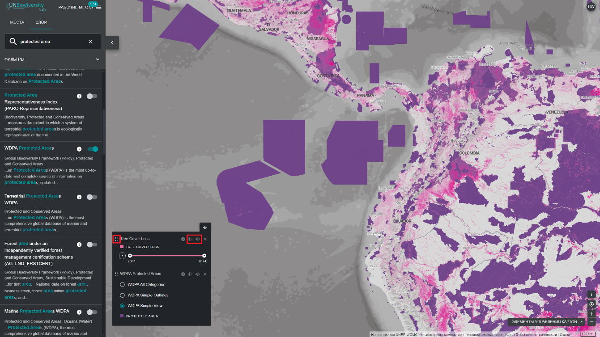

# Как мне настроить просмотр наборов данных?

При выборе нескольких наборов данных вы можете настроить карту, изменив порядок наложения и прозрачность.

1. Чтобы изменить порядок наложения, нажмите и удерживайте значок {style="display: inline; width: 1em; height: 2em; width: 2em;"} слева от названия набора данных в легенде и переместите набор данных вверх или вниз в соответствии с предпочтительным порядком наложения. Верхний набор данных в легенде будет верхним набором данных на карте. 

2. Чтобы изменить непрозрачность, нажмите на значок {style="display: inline; width: 1em; height: 2em; width: 2em;"}. Уменьшение цифры прозрачности увеличивает прозрачность набора данных. Например, чтобы визуализировать как потерю лесного покрова, так и охраняемые территории, можно разместить набор данных о потере лесного покрова над набором данных об охраняемых территориях и настроить прозрачность охраняемых территорий на 60 %. В результате будет создана карта, на которой будет показана потеря лесного покрова в пределах охраняемых территорий, а также общая потеря по всей стране.

3. Чтобы временно скрыть набор данных на карте, нажмите на значок {style="display: inline; width: 1em; height: 2em; width: 2em;"}. Чтобы сделать его видимым снова, нажмите на значок {style="display: inline; width: 1em; height: 2em; width: 2em;"}.

