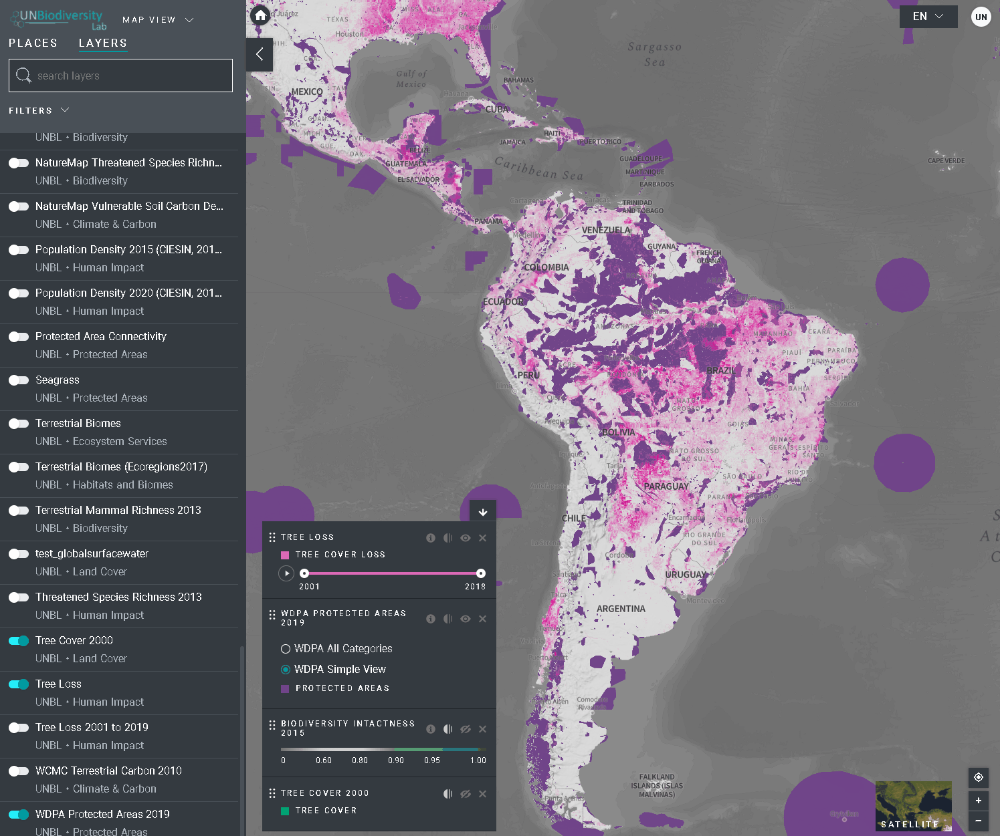

# How do I find more information about each layer?

1. Select the layer and load it to the map.
2. On the left corner of the map, there will be a legend showing the name and symbology of the data layers on the map.  Click on the  icon to view the layer information. The information provides a description of the layer, source organization, citations, and links to download the data.
