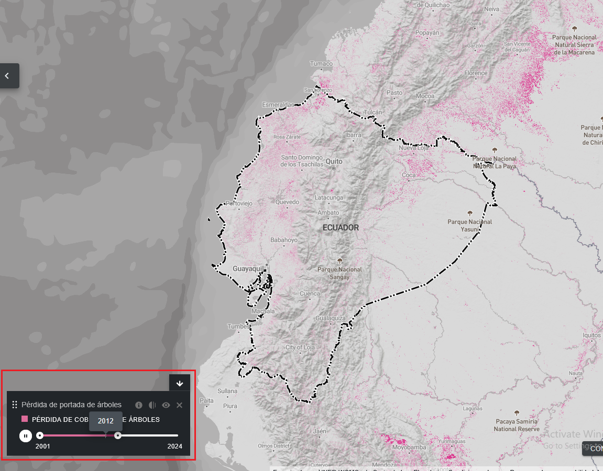
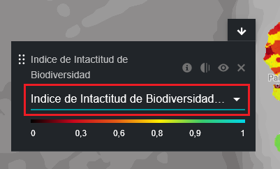
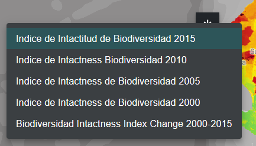

# ¿Qué opciones tengo para visualizar conjuntos de datos de series temporales?

El UN Biodiversity Lab le proporciona acceso a conjuntos de datos que muestran los cambios a lo largo del tiempo. Algunos conjuntos de datos de series temporales se visualizan a lo largo de varios años con animaciones, otros se pueden visualizar por año específico a través del menú desplegable, y algunos son una combinación de ambos, con la posibilidad de visualizar animaciones de años concretos que se pueden seleccionar en el menú desplegable.

Para visualizar conjuntos de datos de series temporales:

1. Seleccione la etiqueta «Series temporales» en la pestaña de filtros para filtrar los conjuntos de datos que están disponibles como series temporales.

2. Seleccione el conjunto de datos que le interese.

3. Personalice en función de las opciones disponibles:

	a) *Solo animación:* Haga clic en el icono de reproducción situado a la izquierda para ver la animación de los cambios a lo largo de este periodo de tiempo. Seleccione una fecha concreta (año, mes o día) que desee mostrar en el mapa haciendo clic directamente en la barra de la línea de tiempo. Para visualizar un intervalo de tiempo personalizado, seleccione una fecha concreta directamente en la barra de la línea de tiempo y, a continuación, haga clic en el icono de reproducción para ver los cambios a lo largo de este periodo de tiempo.
	
	
	
	**O**
	
	b) *Menú desplegable:* seleccione un año específico que desee mostrar en el mapa eligiéndolo entre las capas disponibles en el menú desplegable de la leyenda. Con esta opción solo se puede visualizar una capa de un único periodo de tiempo.

	
	