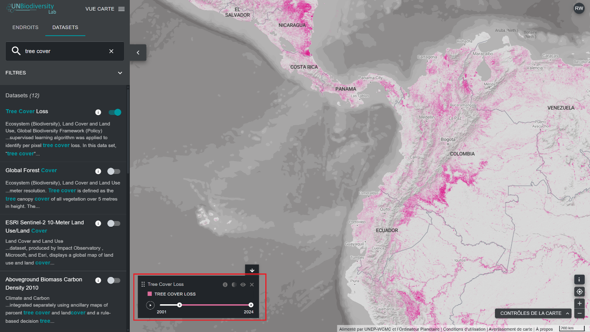
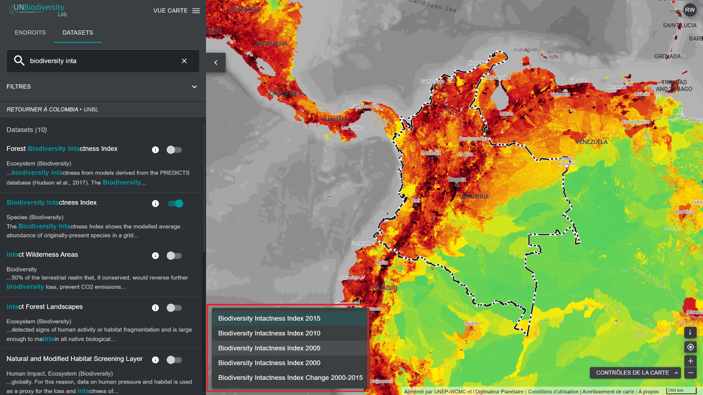

# Quelles sont les options disponibles pour visualiser les ensembles de données chronologiques ?

Le UN Biodiversity Lab vous donne accès à des ensembles de données qui montrent les changements au fil du temps. Certains ensembles de données chronologiques sont visualisés sur plusieurs années à l'aide d'animations, d'autres peuvent être visualisés par année spécifique via le menu déroulant, et certains sont une combinaison des deux, avec la possibilité de visualiser des animations d'années particulières qui peuvent être choisies dans le menu déroulant.

Pour visualiser les ensembles de données chronologiques :

1. Sélectionnez le tag « Time Series » dans l'onglet Filtres pour filtrer les ensembles de données disponibles sous forme de séries chronologiques.

2. Sélectionnez l'ensemble de données qui vous intéresse.

3. Personnalisez en fonction des options disponibles :

	a) *Animation uniquement :* cliquez sur l'icône de lecture à gauche pour voir l'animation des changements survenus au cours de cette période. Sélectionnez une période spécifique (année, mois ou date) que vous souhaitez afficher sur la carte en cliquant directement sur la barre chronologique. Pour visualiser une période personnalisée, sélectionnez une période spécifique directement sur la barre chronologique, puis cliquez sur l'icône de lecture pour voir les changements survenus au cours de cette période.

	

	**OU**

	b) *Menu déroulant :* sélectionnez une année spécifique que vous souhaitez afficher sur la carte en la choisissant parmi les couches disponibles dans le menu déroulant de la légende. Une seule couche de période peut être visualisée à l'aide de cette option.

	