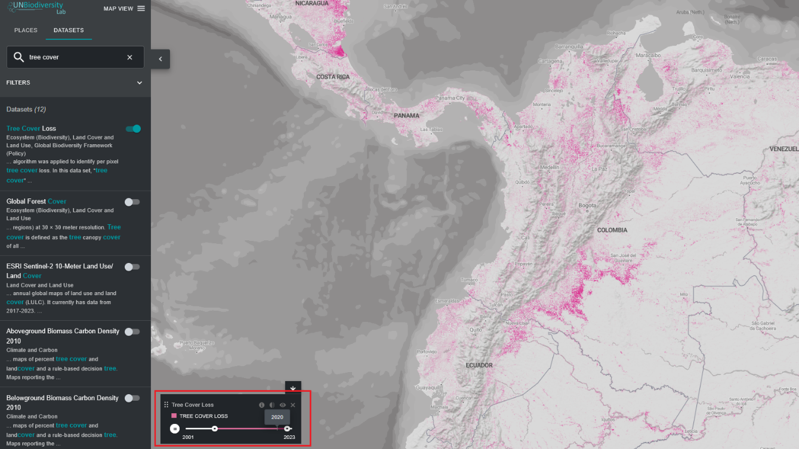
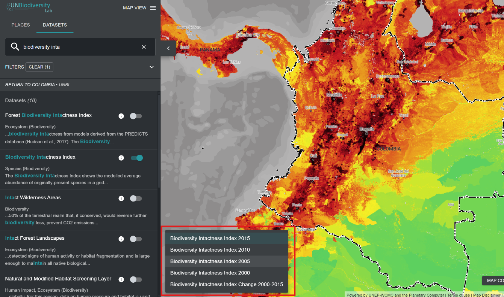

# Quais opções tenho para visualizar conjuntos de dados de séries temporais?

O Laboratório de Biodiversidade da ONU fornece acesso a conjuntos de dados que mostram mudanças ao longo do tempo. Alguns conjuntos de dados de séries temporais são visualizados ao longo de múltiplos anos com animação, outros podem ser visualizados por ano específico via menu suspenso, e alguns são uma combinação de ambos, com a capacidade de visualizar animações de anos específicos que podem ser escolhidos no menu suspenso.

1.  Selecione a tag "Séries temporais" na aba de filtros para filtrar conjuntos de dados que estão disponíveis como séries temporais.

2.	Selecione o conjunto de dados de interesse.
3.	Personalize com base nas opções disponíveis:

	a)	*Apenas animação*: Clique no ícone de reprodução à esquerda para ver a animação das mudanças ao longo deste período de tempo. Selecione um tempo específico (ano, mês ou data) que você deseja mostrar no mapa clicando diretamente na barra da linha do tempo. Para visualizar um intervalo de tempo personalizado, selecione um tempo específico diretamente na barra da linha do tempo e, em seguida, clique no ícone de reprodução para ver as mudanças ao longo deste período de tempo.

	

	**OU**

	b)	*Menu suspenso*: Selecione um ano específico que você deseja mostrar no mapa escolhendo-o nas camadas disponíveis no menu suspenso na legenda. Apenas uma camada de período de tempo único pode ser visualizada usando esta opção.

	

