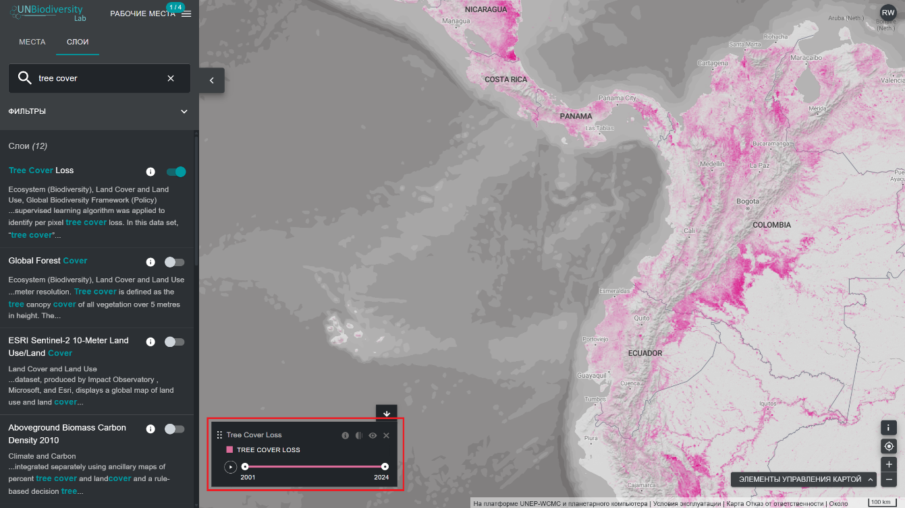
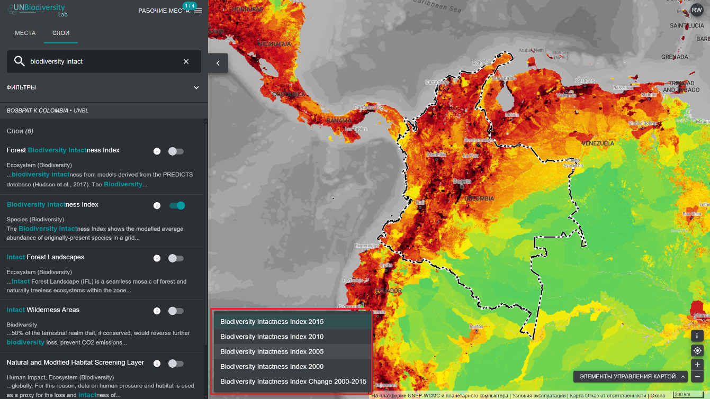

# Какие у меня возможности для визуализации наборов данных, охватывающих непрерывный период времени?

Лаборатория ООН по биоразнообразию предоставляет вам доступ к наборам данных, которые показывают изменения в течение времени. Некоторые наборы данных временных рядов визуализируются за несколько лет с помощью анимации, другие могут быть визуализированы по конкретному году с помощью раскрывающегося меню, а некоторые являются комбинацией обоих вариантов с возможностью визуализации анимации конкретных лет, которые можно выбрать из раскрывающегося меню. 

Чтобы визуализировать наборы данных временных рядов:

1.	Выберите тег «Временные ряды» (Time Series) на вкладке «Фильтры», чтобы отфильтровать наборы данных, доступные в виде временных рядов.

2.	Выберите интересующий вас набор данных. 

3.	Настройте на основе доступных опций:

	a)	*Только анимация*: нажмите на значок воспроизведения слева в легенде, чтобы увидеть анимацию изменений за этот период времени. Выберите конкретное время (год, месяц или дату), которое вы хотите показать на карте, щелкнув непосредственно на панели временной шкалы. Чтобы визуализировать настраиваемый временной диапазон, выберите конкретное время непосредственно на панели временной шкалы, а затем нажмите на значок воспроизведения, чтобы увидеть изменения за этот период времени.

	

	**ИЛИ**

	b)	*Выпадающее меню*: выберите конкретный год, который хотите отобразить на карте, выбрав его из доступных слоев в выпадающем меню на легенде. С помощью этой опции можно визуализировать только один слой временного периода.

	

