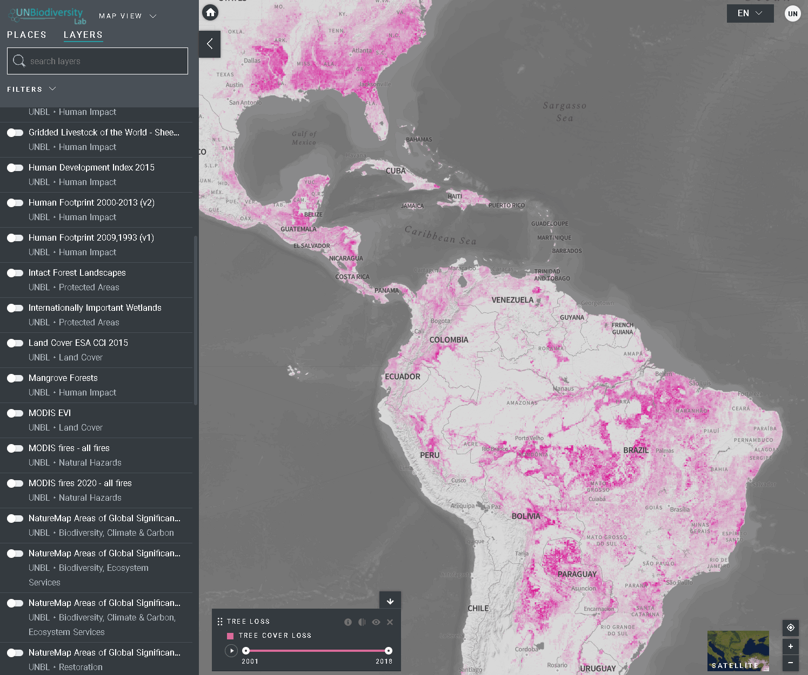

# What options do I have to visualize time series layers?

To visualize time series layers:

1. Review our [data list](data_list.md) to confirm which layers are available as time series.
2. Select the layer of interest.
3. Customize based on the options available:

   - Animation only: Click on the play icon to the left to see the animation of changes over this time period.
   - Specific year only: Select the time (year, month, or date) you want to show on the map by clicking on the timeline bar.
   - Customized animation: Select the time range (year, month, or date) you want to show on the map by clicking on the timeline bar. Click on the play icon to the left to see the animation of changes over this time period.

