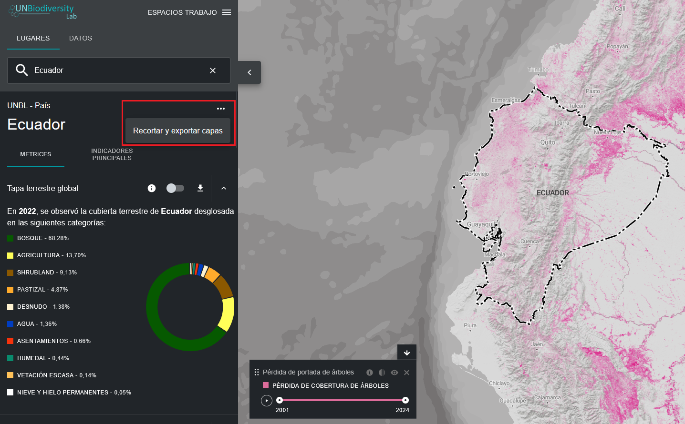
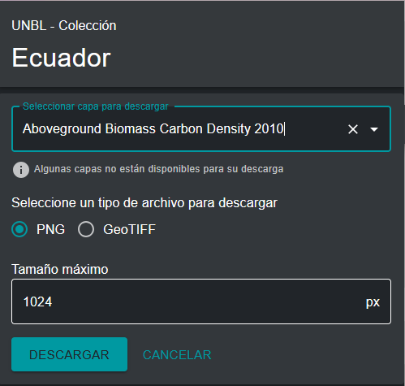

# ¿Cómo puedo recortar y exportar conjuntos de datos?

Los usuarios registrados en el UN Biodiversity Lab pueden recortar conjuntos de datos ráster a un área de interés y descargarlos para utilizarlos en un software SIG de escritorio. Esta función permite a los usuarios acceder a los datos subyacentes, evitando el ancho de banda y el almacenamiento necesarios para descargar y trabajar con un conjunto de datos global.

Para recortar un conjunto de datos a su área de interés y descargarlo:

1. Haga clic en el botón «LUGARES» y seleccione los lugares de su interés.

2. Haga clic en el icono «...» a la derecha del nombre del país y haga clic en «Recortar y exportar capas».

	

3. Escriba el nombre o seleccione los datos que desea descargar. Si los datos contienen capas de varios años, seleccione el año que desea descargar. Tiene la opción de descargar las capas recortadas en formato ráster GeoTIFF o en formato de archivo de imagen PNG.

4. Haga clic en «Descargar».

	- La fuente de datos seleccionada se recortará al cuadro delimitador que rodea al país.
	
	- Se añade un pequeño margen al cuadro delimitador, lo que ampliará ligeramente el área recortada. Esto ayuda a garantizar que cualquier incongruencia entre la frontera nacional utilizada en UNBL y el archivo oficial de fronteras nacionales que desee utilizar no provoque la pérdida de datos. Se parte de la base de que las diferencias son potencialmente pequeñas. Si no es así, póngase en contacto con nosotros en <support@unbiodiversitylab.org> para obtener ayuda.
	
	!!!Note
		Si descarga GeoTIFFs, se trata de datos sin procesar y no incluirán información de estilo.

	
	
5. Acceda al archivo comprimido .zip descargado en su carpeta de descargas una vez completada la descarga.

6. Los datos descargados se pueden abrir en cualquier software SIG para su posterior análisis.