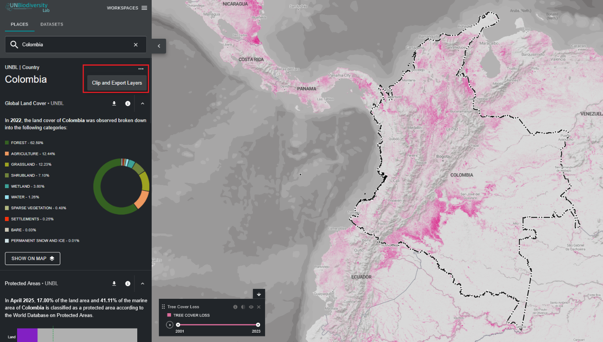
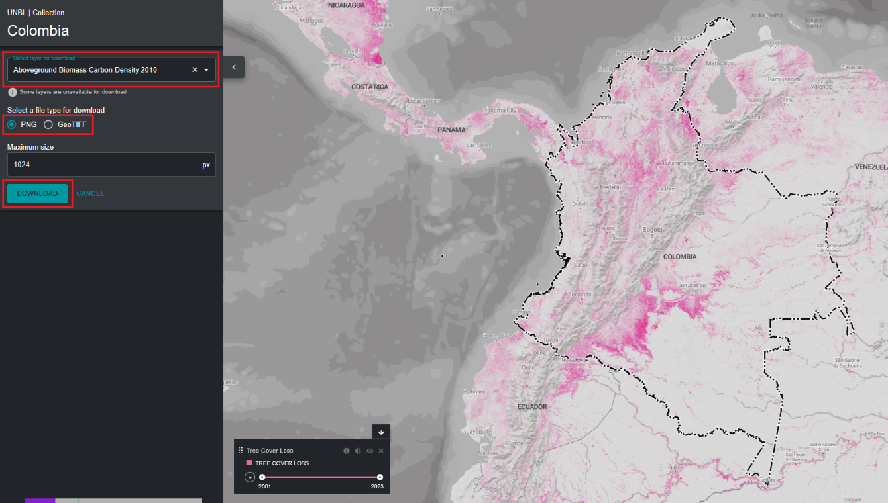

# Comment découper et exporter des ensembles de données ?

Les utilisateurs enregistrés sur le Laboratoire de Biodiversité des Nations Unies peuvent découper des ensembles de données raster sur une zone d'intérêt et les télécharger pour les utiliser dans un logiciel SIG de bureau. Cette fonction permet aux utilisateurs d'accéder aux données sous-jacentes tout en évitant la bande passante et le stockage nécessaires pour télécharger et travailler avec un ensemble de données mondial.

Pour découper un ensemble de données sur votre zone d'intérêt et le télécharger :

1.	Cliquez sur le bouton 'PLACES' et sélectionnez vos lieux d'intérêt.

2.	Cliquez sur l'icône **…** à droite du nom du pays et cliquez sur 'Clip and Export Layers'.

	

3.  Tapez le nom ou sélectionnez les données que vous souhaitez télécharger. Si les données contiennent des couches de plusieurs années, sélectionnez l'année que vous souhaitez télécharger. Vous avez la possibilité de télécharger des couches découpées au format raster GeoTIFF ou au format de fichier image PNG.

4. Cliquez sur télécharger.

	- La source de données sélectionnée sera découpée selon le rectangle englobant autour du pays.

	- Un petit tampon est ajouté au rectangle englobant, ce qui agrandira légèrement la zone du raster découpé. Cela aide à garantir que toute incongruité entre la frontière nationale utilisée dans UNBL et le fichier de frontière nationale officiel que vous pourriez souhaiter utiliser n'entraîne pas de perte de données. Cela suppose que les différences sont potentiellement petites. Si ce n'est pas le cas, veuillez nous contacter à <support@unbiodiversitylab.org> pour obtenir de l'aide.

	!!!Note
		Si vous téléchargez des GeoTIFF, ce sont des données brutes et ne contiendront pas d'informations de style.

	

5.	Accédez au fichier compressé .zip téléchargé dans votre dossier de téléchargements une fois le téléchargement terminé.

6.	Les données téléchargées peuvent être ouvertes dans n'importe quel logiciel SIG pour une analyse plus approfondie.

