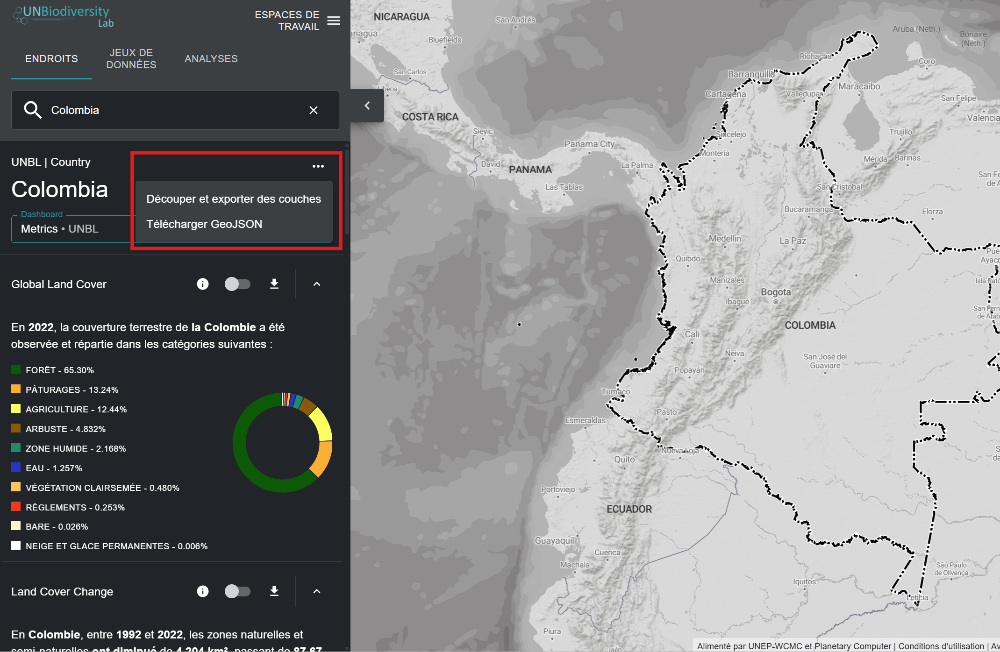
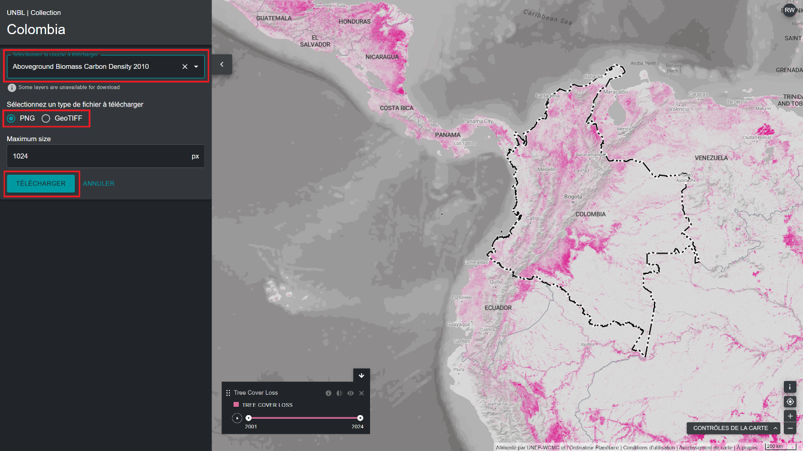

# Comment découper et exporter des ensembles de données ?

Pour découper un ensemble de données correspondant à la zone qui vous intéresse et le télécharger :

- Découper des ensembles de données raster pour les limiter à une zone qui les intéresse et les télécharger afin de les utiliser dans un logiciel SIG de bureau -- cette fonction permet aux utilisateurs d'accéder aux données sous-jacentes tout en évitant la bande passante et le stockage nécessaires pour télécharger et travailler avec un ensemble de données mondial.

- Téléchargez le fichier de limites d'une zone d'intérêt au format GeoJSON pour l'utiliser dans un logiciel SIG de bureau. 

  
▶️ Vous préférez la vidéo ? Cliquez ici !

  

    <iframe
      src="https://www.youtube-nocookie.com/embed/NEkbImR--_4"
      title="UNBL tutorial"
      frameborder="0"
      allow="accelerometer; clipboard-write; encrypted-media; gyroscope; picture-in-picture; web-share"
      allowfullscreen>
    </iframe>
  

Pour ce faire :

1. Cliquez sur le bouton ENDROITS et sélectionnez les lieux qui vous intéressent.

2. Cliquez sur l'icône {style="display: inline; width: 1em; height: 1em; width: 2em;"} située à droite du nom du pays, puis cliquez sur « Télécharger GeoJSON » pour télécharger le fichier des limites de la zone qui vous intéresse, ou cliquez sur « Découper et exporter les couches » si vous souhaitez découper et télécharger un ensemble de données spécifique. Si vous choisissez cette dernière option, suivez les étapes supplémentaires 3 à 6 décrites ci-dessous.

	

3. Saisissez le nom ou sélectionnez les données que vous souhaitez télécharger. Si les données contiennent des couches couvrant plusieurs années, sélectionnez l'année que vous souhaitez télécharger. Vous avez la possibilité de télécharger les couches découpées au format raster GeoTIFF ou au format de fichier image PNG.

4. Cliquez sur Télécharger.

	- La source de données sélectionnée sera découpée dans le cadre entourant le pays.

	- Une petite marge est ajoutée au cadre de sélection, ce qui agrandit légèrement la zone du raster découpé. Cela permet d'éviter toute perte de données en cas d'incohérences entre les frontières nationales utilisées dans le UNBL et le fichier officiel des frontières nationales que vous souhaitez utiliser. Cela suppose que les différences sont potentiellement minimes. Si ce n'est pas le cas, veuillez nous contacter à l'adresse support@unbiodiversitylab.org pour obtenir de l'aide.

	!!! Note
		Si vous téléchargez des fichiers GeoTIFF, il s'agit de données brutes qui ne contiennent pas d'informations de style.

	

5. Une fois le téléchargement terminé, accédez au fichier compressé .zip dans votre dossier de téléchargements.

6. Les données téléchargées peuvent être ouvertes dans n'importe quel logiciel SIG pour une analyse plus approfondie.