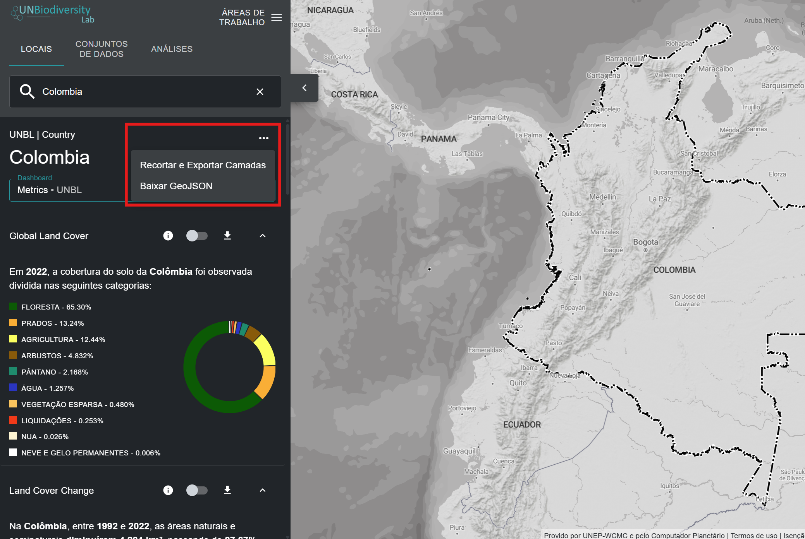

# Como faço para recortar e exportar conjuntos de dados?

Registered users on UN Biodiversity Lab are able to:

- Clip raster datasets to an area of interest and download them for use in a desktop GIS software--this function allows users to access the underlying data while avoiding the bandwidth and storage required to download and work with a global dataset;

- Download the boundary file of an area of interest as a GeoJSON for use in a desktop GIS software. 

To do this:

1.	Clique no botão 'LOCAIS' e selecione seus locais de interesse.

2.	Clique no ícone {style="display: inline; width: 1em; height: 1em; width: 2em;"} à direita do nome do país e clique em «Descarregar GeoJSON» para descarregar o ficheiro de limites da sua área de interesse, ou clique em «Recortar e exportar camadas» se pretender recortar e descarregar um conjunto de dados específico. Se escolher a última opção, siga os passos adicionais 3 a 6 descritos abaixo.

	

3.  Digite o nome ou selecione os dados que você deseja baixar. Se os dados contiverem camadas de múltiplos anos, selecione o ano que você deseja baixar. Você tem a opção de baixar camadas recortadas em formato raster GeoTIFF ou em formato de arquivo de imagem PNG.

4. Clique em baixar.

	- A fonte de dados selecionada será recortada para a caixa delimitadora ao redor do país.

	- Há um pequeno buffer adicionado à caixa delimitadora, que ampliará ligeiramente a área do raster recortado. Isso ajuda a garantir que quaisquer incongruências entre o limite nacional usado no UNBL e o arquivo de limite nacional oficial que você pode desejar usar não resultem em perda de dados. Isso pressupõe que as diferenças sejam potencialmente pequenas. Se este não for o caso, entre em contato conosco em <support@unbiodiversitylab.org> para obter assistência.

	!!!Note
		Se você estiver baixando GeoTIFFs, estes são dados brutos e não incluirão informações de estilo.

	

5.	Acesse o arquivo compactado .zip baixado em sua pasta de downloads assim que o download for concluído.

6.	Os dados baixados podem ser abertos em qualquer software de SIG para análise adicional.

