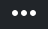
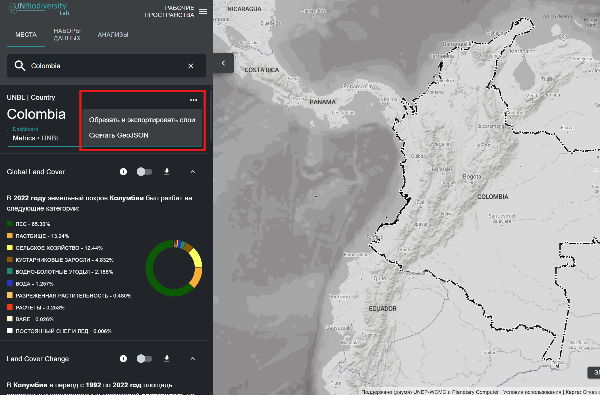
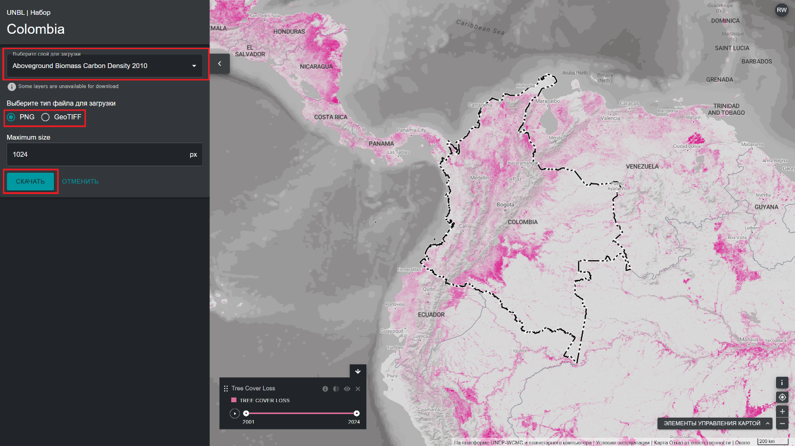

# Как мне вырезать и экспортировать наборы данных?

Зарегистрированные пользователи UNBL могут:

- Вырезать растровые наборы данных по интересующей их области и загружать их для использования в настольном программном обеспечении GIS--Эта функция позволяет пользователям получать доступ к исходным данным, избегая при этом необходимости в пропускной способности и хранилище, требуемых для загрузки и работы с глобальным набором данных. 

-  Cкачать файл с границами интересующего вас района в формате GeoJSON для использования в настольном ГИС-программном обеспечении. 

  
▶️ Предпочитаете видео? Нажмите сюда!

  

    <iframe
      src="https://www.youtube-nocookie.com/embed/V3TljHWPyAM"
      title="UNBL tutorial"
      frameborder="0"
      allow="accelerometer; clipboard-write; encrypted-media; gyroscope; picture-in-picture; web-share"
      allowfullscreen>
    </iframe>
  

 

Для этого:

1.	Нажмите кнопку «МЕСТА» и выберите интересующие вас места.

2.	Нажмите на значок {style="display: inline; width: 1em; height: 1em; width: 2em;"} справа от названия страны и выберите «Скачать GeoJSON», чтобы загрузить файл с границами интересующего вас региона, или нажмите «Обрезать и экспортировать слои», если хотите обрезать и скачать конкретный набор данных. Если вы выбрали последний вариант, выполните дополнительные шаги 3–6, описанные ниже.

	

3.	Введите название или выберите данные, которые хотите загрузить. Если данные содержат слои за несколько лет, выберите год, который хотите загрузить. Вы можете загрузить обрезанные слои в растровом формате GeoTIFF или в формате PNG.

4.	Нажмите «Скачать». 

	- Выбранный источник данных будет обрезан до границ страны. 

	- К ограничивающей рамке добавляется небольшой буфер, который немного увеличивает площадь обрезанного растра. Это помогает обеспечить, чтобы любые несоответствия между национальной границей, используемой в UNBL, и официальным файлом национальных границ, который вы можете использовать, не приводили к потере данных. При этом предполагается, что различия потенциально невелики. Если это не так, обратитесь к нам за помощью по адресу <support@unbiodiversitylab.org>.

	!!!Note
		если вы загружаете файлы GeoTIFF, это необработанные данные, которые не будут содержать информацию о стиле.

	

5.	После завершения загрузки откройте сжатый файл .zip в папке «Загрузки». 

6.	Загруженные данные можно открыть в любом программном обеспечении GIS для дальнейшего анализа.

