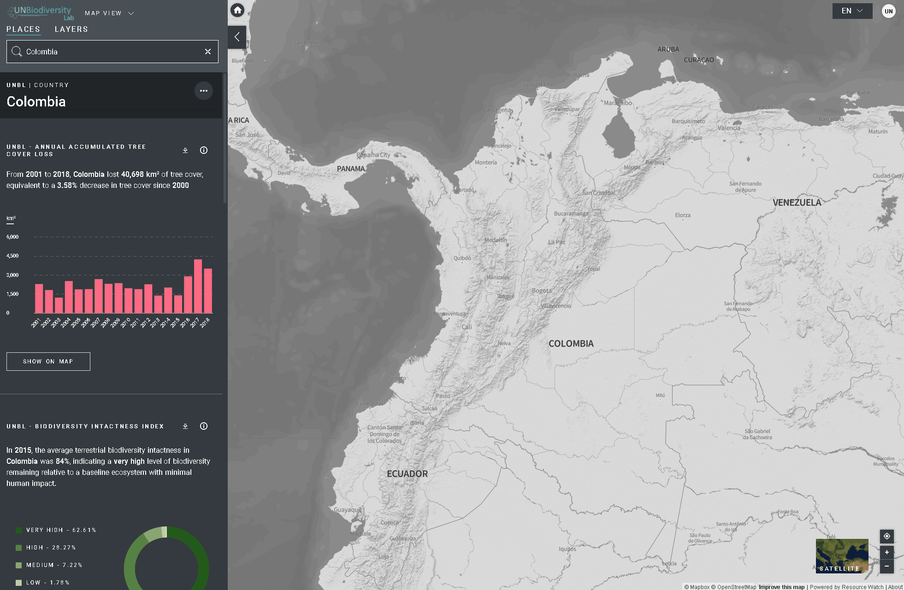

# How do I clip and export layers?

To clip a layer to your area of interest and download:

1. Click on the *PLACES* icon and select your places of interest.
2. Click on the *…* icon on the right of the country's name, and click on Clip and Export Layers.
3. Type the name or select the data you want to download. If the data contains layers of multiple years, select the year you want to download.
4. Click download.
   1. The selected data source will be clipped to the bounding box around the country.
   2. There is a small buffer added to the bounding box, which will slightly enlarge the area of the clipped raster. This helps to ensure that any incongruities between the national boundary used in UNBL and the official national boundary file you may wish to use do not result in loss of data. This assumes that differences are potentially small. If this is not the case, please contact us at <support@unbiodiversitylab.org> for assistance.
   3. *Note: this is the raw data and will not include styling information*.
5. Access the downloaded .zip compressed file in your downloads folder once the download is complete.
6. The downloaded data can be opened in any GIS software for further analysis.
