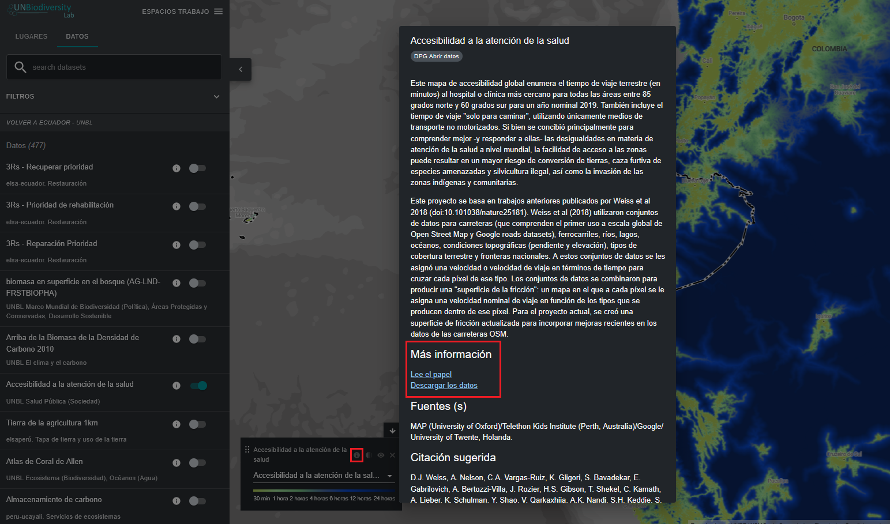

# ¿Cómo descargo conjuntos de datos globales sin recortar?

1. Seleccione el conjunto de datos que le interese.

2. Haga clic en el icono de información del conjunto de datos.

3. Haga clic en el enlace debajo de «MÁS INFORMACIÓN» para descargar los datos de su fuente original (si no se proporciona ningún enlace, es probable que los datos no estén disponibles públicamente para su descarga o que los proveedores de datos hayan retirado los permisos para incluir el enlace de descarga en los metadatos del conjunto de datos en UN Biodiversity Lab).

4. Si tiene algún problema para acceder a los datos, póngase en contacto con <support@unbiodiversitylab.org> para obtener más ayuda.

