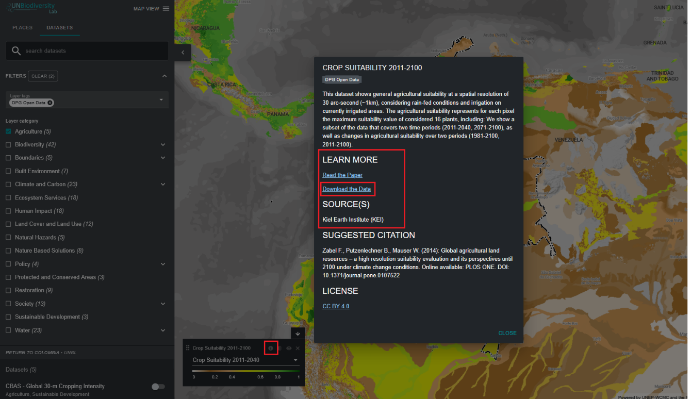

# Comment télécharger des ensembles de données mondiales non découpés ?

1.	Sélectionnez l'ensemble de données d'intérêt.

2.	Cliquez sur l'icône d'information de l'ensemble de données.

3.	Cliquez sur le lien sous 'LEARN MORE' pour télécharger les données depuis leur source d'origine (si aucun lien n'est fourni, cela signifie probablement que les données ne sont pas accessibles publiquement pour le téléchargement ou que les fournisseurs de données ont renoncé aux autorisations d'inclure le lien de téléchargement dans les métadonnées de l'ensemble de données sur le Laboratoire de Biodiversité des Nations Unies).

4.	 Si vous rencontrez des problèmes pour accéder aux données, veuillez contacter support@unbiodiversitylab.org pour obtenir un soutien supplémentaire.

