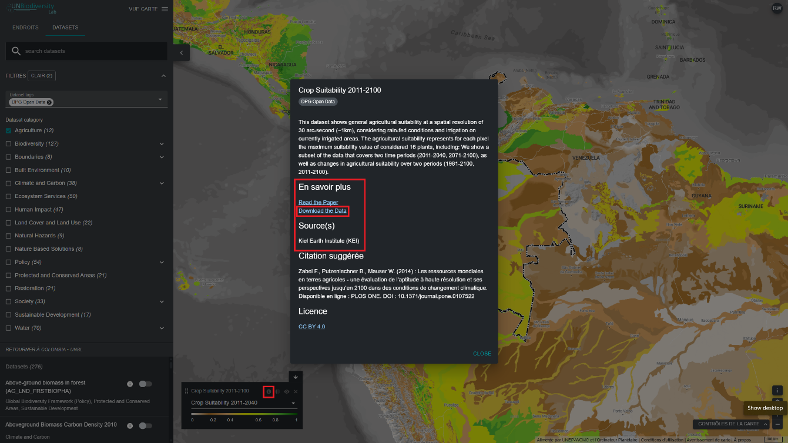

# Comment télécharger des ensembles de données mondiaux non découpés ?

  
▶️ Vous préférez la vidéo ? Cliquez ici !

  

    <iframe
      src="https://www.youtube-nocookie.com/embed/QjSaiBIJRic"
      title="UNBL tutorial"
      frameborder="0"
      allow="accelerometer; clipboard-write; encrypted-media; gyroscope; picture-in-picture; web-share"
      allowfullscreen>
    </iframe>
  

1. Sélectionnez l'ensemble de données qui vous intéresse.

2. Cliquez sur l'icône d'informations sur l'ensemble de données.

3. Cliquez sur le lien sous EN SAVOIR PLUS pour télécharger les données depuis leur source d'origine (si aucun lien n'est fourni, cela signifie probablement que les données ne sont pas accessibles au public ou que les fournisseurs de données ont renoncé à inclure le lien de téléchargement dans les métadonnées de l'ensemble de données sur le UN Biodiversity Lab).

4. Si vous rencontrez des difficultés pour accéder aux données, veuillez contacter support@unbiodiversitylab.org pour obtenir de l'aide.

