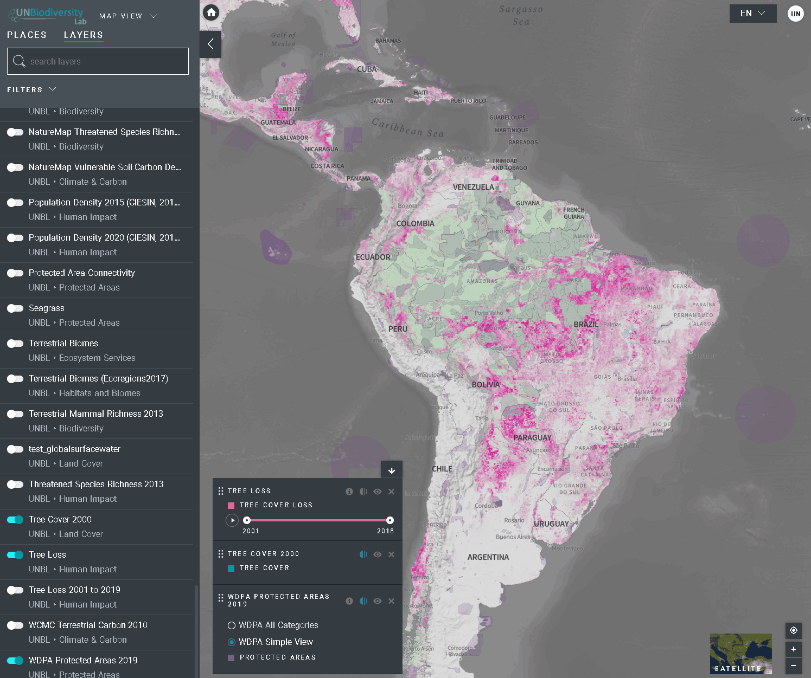

# How do I download unclipped global data layers?

1. Select the layer of interest.
2. Click on the layer info icon.
3. Click on the link under *LEARN MORE*  to download the data from its original source.

If you encounter any issues in accessing the data, please contact <support@unbiodiversitylab.org> for further support.
