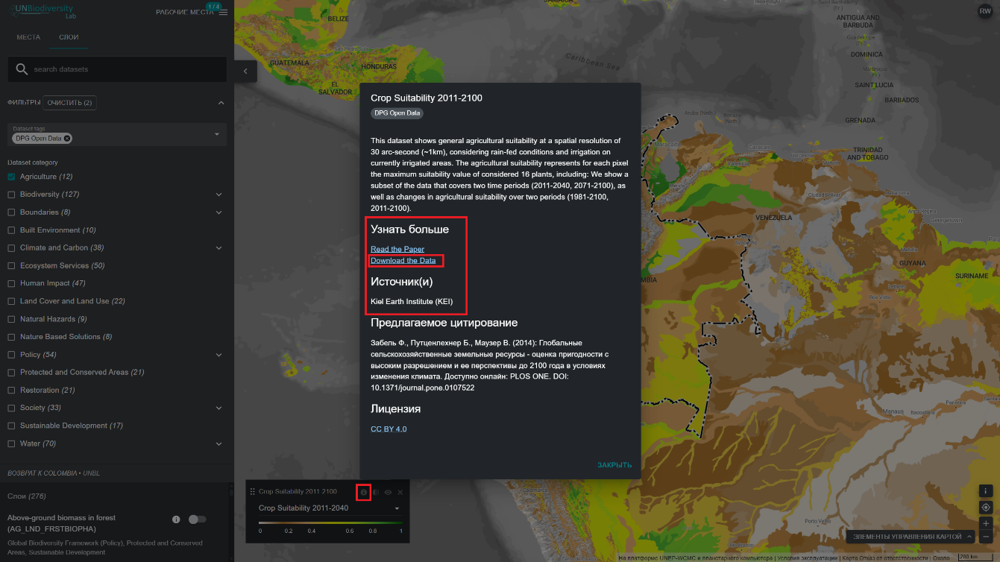

# Как мне загрузить необрезанные глобальные наборы данных?

  
▶️ Предпочитаете видео? Нажмите сюда!

  

    <iframe
      src="https://www.youtube-nocookie.com/embed/Lc5j4j3rsoE"
      title="UNBL tutorial"
      frameborder="0"
      allow="accelerometer; clipboard-write; encrypted-media; gyroscope; picture-in-picture; web-share"
      allowfullscreen>
    </iframe>
  

1.	Выберите интересующий вас набор данных.

2.	Нажмите на значок информации о наборе данных.

3.	Нажмите на ссылку под надписью «УЗНАЙТЕ БОЛЬШЕ», чтобы загрузить данные из их исходного источника (если ссылка отсутствует, это, вероятно, означает, что данные не доступны для общественного скачивания или что поставщики данных отказались от разрешения на включение ссылки для скачивания в метаданные набора данных на сайте UNBL). 

4.	 Если у вас возникли проблемы с доступом к данным, обратитесь за дополнительной поддержкой по адресу <support@unbiodiversitylab.org>. 

