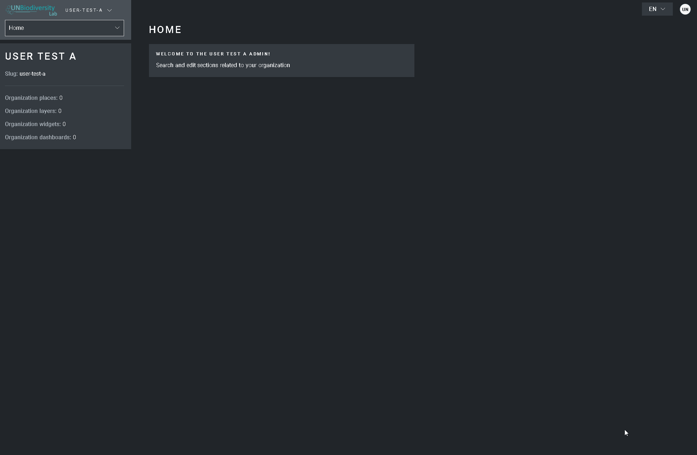

# What are UNBL workspaces? How do I request a workspace?

We recognize that national data is often higher quality and better suited to countries' needs for decision-making, monitoring, and reporting. UNBL offers free workspaces to stakeholders who need a secure area to access and use spatial data. Our workspaces can serve as a common data repository, offer a collaborative work environment, and enable you to calculate dynamic indicators for a sub-national or transboundary area of interest. These password-protected spaces enable you to control access to your data, and ensure data security through storage on UN servers.

We encourage users to explore how UNBL workspaces can help you to build communities of practice to transform data to action.

To request a secure UNBL workspace please contact support@unbiodiversitylab.org or click on the UNBL workspaces tab on our [support page](https://www.unbiodiversitylab.org/support/) and fill out the form.
